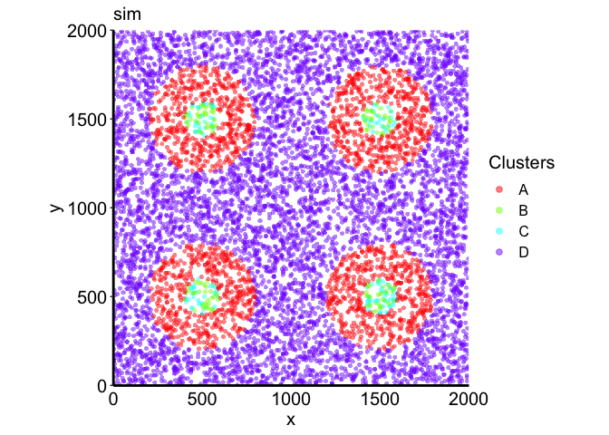
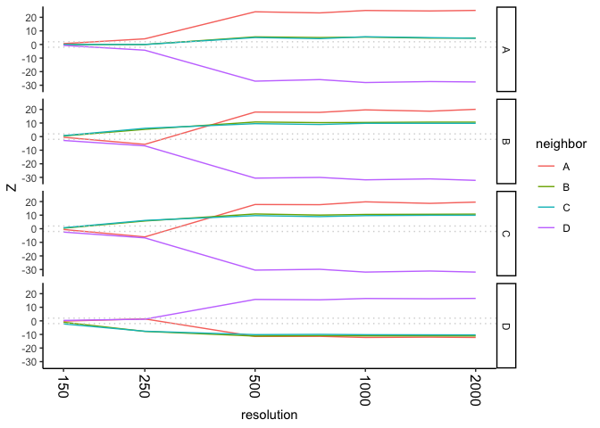
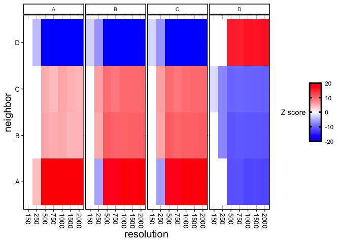
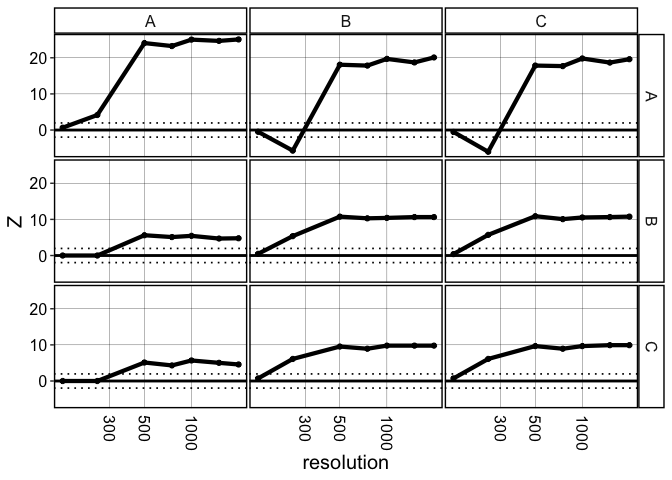

``` r
library(crawdad)
library(dplyr)
```

``` r
ncores = 2
```

``` r
## folder on `brendan` branch
figpath <- paste0(here::here(), "/plots/sim")
```

## Make simulated dataset

``` r
## cells
set.seed(1)
size <- 8000
x <- runif(size, min = 0, max = 2000)
y <- runif(size, min = 0, max = 2000)
p <- data.frame(x = x, y = y, type='D')
rownames(p) <- paste0('cell', 1:size)

## structures

## large A circles
as <- c(250, 250, 750, 750)*2
bs <- c(250, 750, 250, 750)*2
invisible(sapply(1:4, function(i) {
  a <- as[i]
  b <- bs[i]
  ro <- 150*2
  co <- 'A'
  po <- 1
  c1o <- rownames(p[((p$x-a)^2 + (p$y - b)^2 < ro^2),])
  p[c1o,]$type <<- sample(co, size = length(c1o), replace = TRUE, prob = po)
}))

## B blobs inside A blobs
invisible(sapply(1:4, function(i) {
  ro <- 50*2 # 80
  # co <- 'B'
  co <- c('B', 'C')
  # po <- 1
  po <- c(0.5, 0.5)
  
  ## inside structure
  a <- as[i]
  b <- bs[i]
  c1o <- rownames(p[((p$x-a)^2 + (p$y - b)^2 < ro^2),])
  p[c1o,]$type <<- sample(co, size = length(c1o), replace = TRUE, prob = po)
}))

## visualize
plt <- crawdad::vizAllClusters(cells = p,
                               coms = p$type,
                               title = "sim",
                               axisAdj = 1, s = 6, a = 0.5) +
  ggplot2::guides(colour = ggplot2::guide_legend(override.aes = list(size=2), ncol = 1))
plt
```



``` r
# ggplot2::ggsave(filename = "1_sim_tissue_legend.pdf",
#                 plot = plt,
#                 device = "pdf",
#                 path = figpath,
#                 scale = 1,
#                 width = 6,
#                 height = 6,
#                 units = c("in"))
```

Convert the data.frame of cells to an `sp::SpatialPointsDataFrame`
object. This is because CRAWDAD builds upon the `sf` library in R.

``` r
## convert to SP
cells <- crawdad::toSP(pos = p[,c("x", "y")],
                        celltypes = p$type)
```

    ## Warning: 'celltypes' does not have levels. Creating levels from values

    ## creating `sp::SpatialPointsDataFrame`

``` r
cells
```

    ## Simple feature collection with 8000 features and 1 field
    ## Attribute-geometry relationship: 1 constant, 0 aggregate, 0 identity
    ## Geometry type: POINT
    ## Dimension:     XY
    ## Bounding box:  xmin: 0.2128673 ymin: 0.2413117 xmax: 1999.861 ymax: 1999.71
    ## CRS:           NA
    ## First 10 features:
    ##    celltypes                  geometry
    ## 1          A POINT (531.0173 256.5303)
    ## 2          D  POINT (744.2478 255.383)
    ## 3          D POINT (1145.707 1555.465)
    ## 4          D POINT (1816.416 840.3007)
    ## 5          A POINT (403.3639 1431.804)
    ## 6          D POINT (1796.779 306.6082)
    ## 7          D POINT (1889.351 176.4733)
    ## 8          A POINT (1321.596 410.0539)
    ## 9          D POINT (1258.228 42.36819)
    ## 10         D POINT (123.5725 1190.803)

## Make shuffled background

`CRAWDAD` identifies cell type spatial relationships by comparing cell
type organizational patterns in the real data to a set of null
distributions, which are a datasets in which cell labels have been
shuffled at different scales, or resolutions. We can generate this list
of shuffled datasets with the following code:

``` r
oldw <- getOption("warn")
options(warn = -1)

## generate background
shuffle.list <- crawdad::makeShuffledCells(cells,
                          resolutions = c(150, 250, 500, 750, 1000, 1500, 2000),
                          perms = 1,
                          ncores = ncores,
                          seed = 1,
                          verbose = TRUE)
```

    ## shuffling permutation 1 using seed 1

    ## 150 unit resolution

    ## 196 tiles to shuffle...

    ## shuffling permutation 1 using seed 1

    ## 250 unit resolution

    ## 64 tiles to shuffle...

    ## shuffling permutation 1 using seed 1

    ## 500 unit resolution

    ## 16 tiles to shuffle...

    ## shuffling permutation 1 using seed 1

    ## 750 unit resolution

    ## 9 tiles to shuffle...

    ## shuffling permutation 1 using seed 1

    ## 1000 unit resolution

    ## 4 tiles to shuffle...

    ## shuffling permutation 1 using seed 1

    ## 1500 unit resolution

    ## 4 tiles to shuffle...

    ## shuffling permutation 1 using seed 1

    ## 2000 unit resolution

    ## 1 tiles to shuffle...

    ## Time was 0.29 mins

``` r
options(warn = oldw)
```

## Run pairwise analysis

We can identify trends that describe spatial relationships between
pairwise combinations of cell types in our data. `dist` refers to the
distance at which neighbor cells are defined. In this example, we assess
if the neighbors of each cell type are enriched or depleted in cells of
another given cell type compared to each shuffled resolution of the
data.

``` r
oldw <- getOption("warn")
options(warn = -1)

## find trends, passing background as parameter
results <- crawdad::findTrends(cells,
                        dist = 100,
                        shuffle.list = shuffle.list,
                        ncores = ncores,
                        verbose = TRUE)
```

    ## Evaluating significance for each cell type

    ## using neighbor distance of 100

    ## Calculating for pairwise combinations

    ## A

    ## B

    ## C

    ## D

    ## Time was 0.63 mins

``` r
options(warn = oldw)
```

``` r
dat <- crawdad::meltResultsList(results)

plt <- ggplot2::ggplot(dat, ggplot2::aes(x=resolution, y=Z, col=neighbor)) +
  ggplot2::geom_line() +
  ggplot2::facet_grid(rows = ggplot2::vars(reference)) +
  ggplot2::theme_classic() +
  ggplot2::geom_hline(yintercept = 2, col='lightgrey' ,linetype="dotted") + 
  ggplot2::geom_hline(yintercept = -2, col='lightgrey',linetype="dotted") +
  ggplot2::scale_x_continuous(trans='log10', breaks = c(150, 250, 500, 1000, 2000)) +
  
  ggplot2::theme(axis.text.x = ggplot2::element_text(size=12, color = "black", angle = -90, vjust = 0.5, hjust = 0),
                   # axis.text.y = ggplot2::element_text(size=12, color = "black"),
                   # axis.title.y = ggplot2::element_text(size=15),
                   # axis.title.x = ggplot2::element_text(size=15),
                   # axis.ticks.x = ggplot2::element_blank(),
                   # plot.title = ggplot2::element_text(size=15),
                   plot.background = ggplot2::element_blank(),
                   legend.background = ggplot2::element_blank(),
                   panel.background = ggplot2::element_blank()
                   # panel.grid.major =  ggplot2::element_line(size = 0.1, colour = "black"),
                   # panel.border = ggplot2::element_rect(colour = "black", fill=NA, size=1),
                   # axis.line = ggplot2::element_line(size = 0, colour = "black"),
                   # panel.spacing = ggplot2::unit(0.1, "lines"),
                   # strip.text = ggplot2::element_text(size = 12),
                   # legend.title = ggplot2::element_blank(),
                   # legend.position="none"
    )
plt
```



``` r
# ggplot2::ggsave(filename = "1_sim_trends.pdf",
#                 plot = plt,
#                 device = "pdf",
#                 path = figpath,
#                 scale = 1,
#                 width = 8,
#                 height = 6,
#                 units = c("in"))
```

``` r
plt <- vizTrends.heatmap(dat = results)
```

    ## results detected to be a list. Melting to data.frame.

``` r
plt
```



``` r
# ggplot2::ggsave(filename = "S1_sim_trends_heatmap.pdf",
#                 plot = plt,
#                 device = "pdf",
#                 path = figpath,
#                 scale = 1,
#                 width = 6,
#                 height = 2,
#                 units = c("in"))
```

``` r
dat <- crawdad::meltResultsList(results)

dat <- dat[dat$reference %in% c("A", "B", "C") & dat$neighbor %in% c("A", "B", "C"),]

plt <- vizTrends(dat = dat) +
  ggplot2::scale_x_log10()
plt
```



``` r
# ggplot2::ggsave(filename = "1_sim_trends_selected.pdf",
#                 plot = plt,
#                 device = "pdf",
#                 path = figpath,
#                 scale = 1,
#                 width = 8,
#                 height = 6,
#                 units = c("in"))
```
