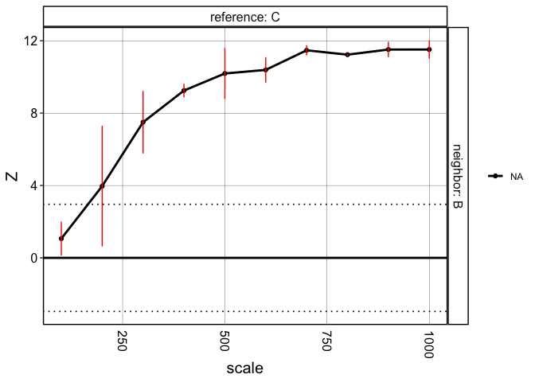

``` r
library(crawdad)
library(tidyverse)
```

    ## ── Attaching core tidyverse packages ──────────────────────── tidyverse 2.0.0 ──
    ## ✔ dplyr     1.1.2     ✔ readr     2.1.4
    ## ✔ forcats   1.0.0     ✔ stringr   1.5.0
    ## ✔ ggplot2   3.4.2     ✔ tibble    3.2.1
    ## ✔ lubridate 1.9.2     ✔ tidyr     1.3.0
    ## ✔ purrr     1.0.1     
    ## ── Conflicts ────────────────────────────────────────── tidyverse_conflicts() ──
    ## ✖ dplyr::filter() masks stats::filter()
    ## ✖ dplyr::lag()    masks stats::lag()
    ## ℹ Use the conflicted package (<http://conflicted.r-lib.org/>) to force all conflicts to become errors

``` r
ncores = 7
```

# Load data

Load data.frame of cell positions and labels and convert it to an `sf` object. This is because CRAWDAD builds upon the `sf` library in R.

``` r
data(sim)

## convert to sp::SpatialPointsDataFrame
cells <- crawdad:::toSF(pos = sim[,c("x", "y")],
                        celltypes = sim$celltypes)
```

    ## Warning: 'celltypes' does not have levels. Creating levels from values

    ## creating `sp::SpatialPointsDataFrame`

# Make shuffled background

`CRAWDAD` identifies cell type spatial relationships by comparing cell
type organizational patterns in the real data to a set of null
distributions, which are a datasets that the cell labels have been
shuffled at different scales, or resolutions. We can generate this list
of shuffled datasets with the following code:

``` r
## generate background
shuffle.list <- crawdad::makeShuffledCells(cells,
                          scales = seq(100, 1000, by=50),
                          perms = 3,
                          ncores = ncores,
                          seed = 1,
                          verbose = TRUE)
```

    ## shuffling permutation 1 using seed 1

    ## 100 unit scale

    ## 400 tiles to shuffle...

    ## shuffling permutation 2 using seed 2

    ## 100 unit scale

    ## 441 tiles to shuffle...

    ## shuffling permutation 3 using seed 3

    ## 100 unit scale

    ## 441 tiles to shuffle...

    ## shuffling permutation 1 using seed 1

    ## 150 unit scale

    ## 196 tiles to shuffle...

    ## shuffling permutation 2 using seed 2

    ## 150 unit scale

    ## 196 tiles to shuffle...

    ## shuffling permutation 3 using seed 3

    ## 150 unit scale

    ## 196 tiles to shuffle...

    ## shuffling permutation 1 using seed 1

    ## 200 unit scale

    ## 100 tiles to shuffle...

    ## shuffling permutation 2 using seed 2

    ## 200 unit scale

    ## 121 tiles to shuffle...

    ## shuffling permutation 3 using seed 3

    ## 200 unit scale

    ## 121 tiles to shuffle...

    ## shuffling permutation 1 using seed 1

    ## 250 unit scale

    ## 64 tiles to shuffle...

    ## shuffling permutation 2 using seed 2

    ## 250 unit scale

    ## 81 tiles to shuffle...

    ## shuffling permutation 3 using seed 3

    ## 250 unit scale

    ## 81 tiles to shuffle...

    ## shuffling permutation 1 using seed 1

    ## 300 unit scale

    ## 49 tiles to shuffle...

    ## shuffling permutation 2 using seed 2

    ## 300 unit scale

    ## 49 tiles to shuffle...

    ## shuffling permutation 3 using seed 3

    ## 300 unit scale

    ## 64 tiles to shuffle...

    ## shuffling permutation 1 using seed 1

    ## 350 unit scale

    ## 36 tiles to shuffle...

    ## shuffling permutation 2 using seed 2

    ## 350 unit scale

    ## 49 tiles to shuffle...

    ## shuffling permutation 3 using seed 3

    ## 350 unit scale

    ## 49 tiles to shuffle...

    ## shuffling permutation 1 using seed 1

    ## 400 unit scale

    ## 25 tiles to shuffle...

    ## shuffling permutation 2 using seed 2

    ## 400 unit scale

    ## 36 tiles to shuffle...

    ## shuffling permutation 3 using seed 3

    ## 400 unit scale

    ## 36 tiles to shuffle...

    ## shuffling permutation 1 using seed 1

    ## 450 unit scale

    ## 25 tiles to shuffle...

    ## shuffling permutation 2 using seed 2

    ## 450 unit scale

    ## 25 tiles to shuffle...

    ## shuffling permutation 3 using seed 3

    ## 450 unit scale

    ## 36 tiles to shuffle...

    ## shuffling permutation 1 using seed 1

    ## 500 unit scale

    ## 16 tiles to shuffle...

    ## shuffling permutation 2 using seed 2

    ## 500 unit scale

    ## 25 tiles to shuffle...

    ## shuffling permutation 3 using seed 3

    ## 500 unit scale

    ## 25 tiles to shuffle...

    ## shuffling permutation 1 using seed 1

    ## 550 unit scale

    ## 16 tiles to shuffle...

    ## shuffling permutation 2 using seed 2

    ## 550 unit scale

    ## 16 tiles to shuffle...

    ## shuffling permutation 3 using seed 3

    ## 550 unit scale

    ## 25 tiles to shuffle...

    ## shuffling permutation 1 using seed 1

    ## 600 unit scale

    ## 16 tiles to shuffle...

    ## shuffling permutation 2 using seed 2

    ## 600 unit scale

    ## 16 tiles to shuffle...

    ## shuffling permutation 3 using seed 3

    ## 600 unit scale

    ## 16 tiles to shuffle...

    ## shuffling permutation 1 using seed 1

    ## 650 unit scale

    ## 16 tiles to shuffle...

    ## shuffling permutation 2 using seed 2

    ## 650 unit scale

    ## 16 tiles to shuffle...

    ## shuffling permutation 3 using seed 3

    ## 650 unit scale

    ## 16 tiles to shuffle...

    ## shuffling permutation 1 using seed 1

    ## 700 unit scale

    ## 9 tiles to shuffle...

    ## shuffling permutation 2 using seed 2

    ## 700 unit scale

    ## 16 tiles to shuffle...

    ## shuffling permutation 3 using seed 3

    ## 700 unit scale

    ## 16 tiles to shuffle...

    ## shuffling permutation 1 using seed 1

    ## 750 unit scale

    ## 9 tiles to shuffle...

    ## shuffling permutation 2 using seed 2

    ## 750 unit scale

    ## 9 tiles to shuffle...

    ## shuffling permutation 3 using seed 3

    ## 750 unit scale

    ## 16 tiles to shuffle...

    ## shuffling permutation 1 using seed 1

    ## 800 unit scale

    ## 9 tiles to shuffle...

    ## shuffling permutation 2 using seed 2

    ## 800 unit scale

    ## 9 tiles to shuffle...

    ## shuffling permutation 3 using seed 3

    ## 800 unit scale

    ## 16 tiles to shuffle...

    ## shuffling permutation 1 using seed 1

    ## 850 unit scale

    ## 9 tiles to shuffle...

    ## shuffling permutation 2 using seed 2

    ## 850 unit scale

    ## 9 tiles to shuffle...

    ## shuffling permutation 3 using seed 3

    ## 850 unit scale

    ## 16 tiles to shuffle...

    ## shuffling permutation 1 using seed 1

    ## 900 unit scale

    ## 9 tiles to shuffle...

    ## shuffling permutation 2 using seed 2

    ## 900 unit scale

    ## 9 tiles to shuffle...

    ## shuffling permutation 3 using seed 3

    ## 900 unit scale

    ## 9 tiles to shuffle...

    ## shuffling permutation 1 using seed 1

    ## 950 unit scale

    ## 9 tiles to shuffle...

    ## shuffling permutation 2 using seed 2

    ## 950 unit scale

    ## 9 tiles to shuffle...

    ## shuffling permutation 3 using seed 3

    ## 950 unit scale

    ## 9 tiles to shuffle...

    ## shuffling permutation 1 using seed 1

    ## 1000 unit scale

    ## 4 tiles to shuffle...

    ## shuffling permutation 2 using seed 2

    ## 1000 unit scale

    ## 9 tiles to shuffle...

    ## shuffling permutation 3 using seed 3

    ## 1000 unit scale

    ## 9 tiles to shuffle...

    ## Time was 11.1 mins

# Run pairwise analysis

We can identify trends that describe spatial relationships between
pairwise combinations of cell types in our data. `dist` refers to the
distance at which neighbor cells are defined. In this example, we assess
if the neighbors of each cell type are enriched or depleted in cells of
another given cell type compared to each shuffled scale of the data.

``` r
## find trends, passing background as parameter
results <- crawdad::findTrends(cells,
                        dist = 100,
                        shuffle.list = shuffle.list,
                        ncores = ncores,
                        verbose = TRUE, 
                        returnMeans = FALSE)
```

    ## Evaluating significance for each cell type

    ## using neighbor distance of 100

    ## Calculating for pairwise combinations

    ## A

    ## B

    ## C

    ## D

    ## Time was 1.23 mins

``` r
## convert results to data.frame
dat <- crawdad::meltResultsList(results, withPerms = T)
```

# Visualize results

``` r
## multiple-test correction
ntests <- length(unique(dat$reference)) * length(unique(dat$reference))
psig <- 0.05/ntests
zsig <- round(qnorm(psig/2, lower.tail = F), 2)
```

Summary visualization of CRAWDAD’s multi-scale cell-type spatial
relationship analysis.

``` r
vizColocDotplot(dat, reorder = TRUE, zsig.thresh = zsig, zscore.limit = zsig*2) +
  theme(legend.position='right',
        axis.text.x = element_text(angle = 45, h = 0))
```

    ## Scale for x is already present.
    ## Adding another scale for x, which will replace the existing scale.


Visualize specific trends.

``` r
dat_filter <- dat %>% 
  filter(reference == 'C') %>% 
  filter(neighbor == 'B')
vizTrends(dat_filter, lines = T, withPerms = T, sig.thresh = zsig)
```



``` r
dat_filter <- dat %>% 
  filter(reference == 'A') %>% 
  filter(neighbor == 'B')
vizTrends(dat_filter, lines = T, withPerms = T, sig.thresh = zsig)
```


