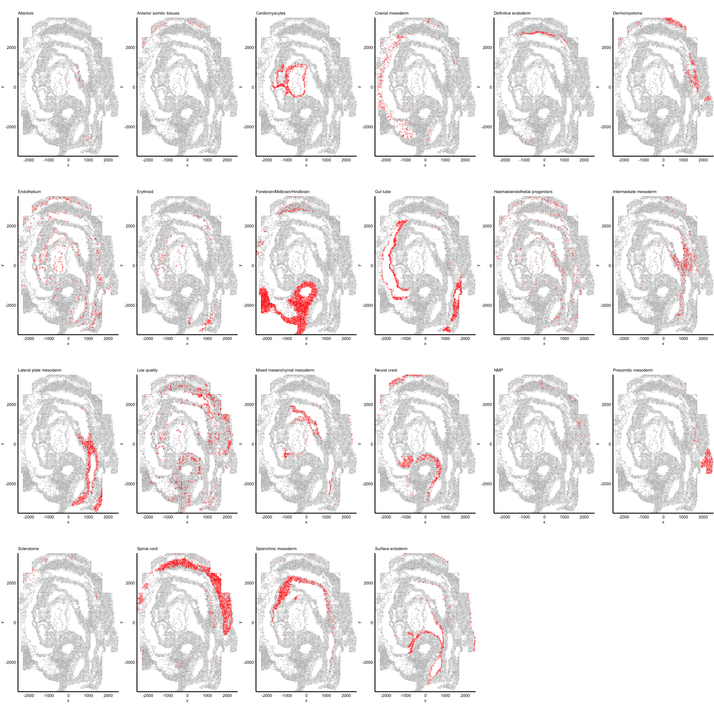
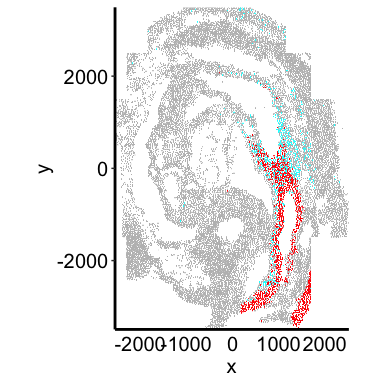
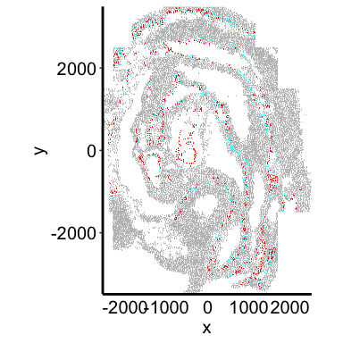
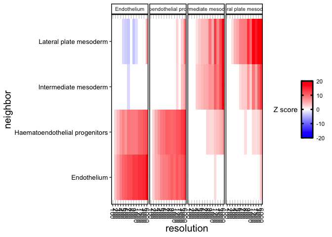
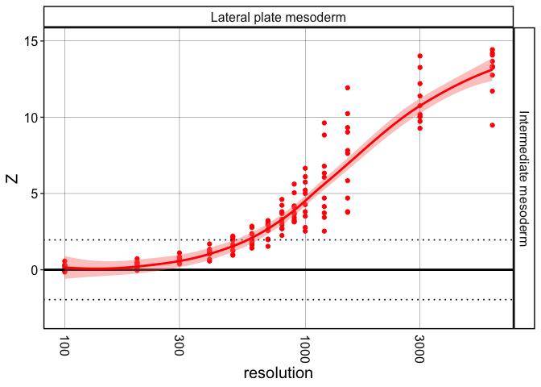
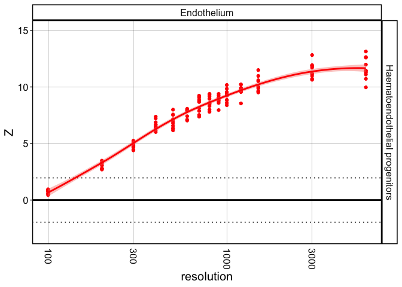

This vignette will go through analyses to reproduce the results and
figures of the SeqFISH dataset.

``` r
library(crawdad)
library(dplyr)
```

``` r
ncores = 2
```

# Load data

``` r
seq <- read.csv2(file = paste0(here::here(), "/data/seqfish/seqfish.meta.csv"), row.names = 1, sep = ",")
seq <- seq[,c("x", "y", "cluster")]
## make sure the coordinates are numeric
seq <- seq %>%
  dplyr::mutate_at(vars(x, y), as.numeric)

## convert to SP
seq <- crawdad:::toSP(pos = seq[,c("x", "y")],
                        celltypes = seq$cluster)
seq
```

``` r
## the above dataset has been saved as an rda file and able to load here:
data(seq)

## convert to SP
seq <- crawdad:::toSP(pos = seq[,c("x", "y")],
                        celltypes = seq$celltypes)
```

    ## Warning: 'celltypes' does not have levels. Creating levels from values

    ## creating `sp::SpatialPointsDataFrame`

``` r
seq
```

    ## Simple feature collection with 19416 features and 1 field
    ## Attribute-geometry relationship: 1 constant, 0 aggregate, 0 identity
    ## Geometry type: POINT
    ## Dimension:     XY
    ## Bounding box:  xmin: -2549.368 ymin: -3492.084 xmax: 2520.294 ymax: 3492.084
    ## CRS:           NA
    ## First 10 features:
    ##                 celltypes                   geometry
    ## 1             Low quality POINT (729.2607 -2821.746)
    ## 2  Lateral plate mesoderm POINT (708.4369 -2707.126)
    ## 3               Erythroid  POINT (961.726 -2943.951)
    ## 4  Lateral plate mesoderm POINT (976.3043 -2517.971)
    ## 5               Erythroid POINT (959.8796 -3000.712)
    ## 6               Allantois POINT (974.9348 -2673.964)
    ## 7                Gut tube POINT (983.0538 -3284.372)
    ## 8             Endothelium POINT (993.3884 -3200.491)
    ## 9             Low quality POINT (977.8156 -3099.205)
    ## 10 Lateral plate mesoderm  POINT (983.8553 -2634.19)

# Visualize celltypes

``` r
crawdad::vizEachCluster(cells = seq,
                        coms = as.factor(seq$celltypes),
                        s = 2)
```



    ## TableGrob (4 x 6) "arrange": 22 grobs
    ##     z     cells    name           grob
    ## 1   1 (1-1,1-1) arrange gtable[layout]
    ## 2   2 (1-1,2-2) arrange gtable[layout]
    ## 3   3 (1-1,3-3) arrange gtable[layout]
    ## 4   4 (1-1,4-4) arrange gtable[layout]
    ## 5   5 (1-1,5-5) arrange gtable[layout]
    ## 6   6 (1-1,6-6) arrange gtable[layout]
    ## 7   7 (2-2,1-1) arrange gtable[layout]
    ## 8   8 (2-2,2-2) arrange gtable[layout]
    ## 9   9 (2-2,3-3) arrange gtable[layout]
    ## 10 10 (2-2,4-4) arrange gtable[layout]
    ## 11 11 (2-2,5-5) arrange gtable[layout]
    ## 12 12 (2-2,6-6) arrange gtable[layout]
    ## 13 13 (3-3,1-1) arrange gtable[layout]
    ## 14 14 (3-3,2-2) arrange gtable[layout]
    ## 15 15 (3-3,3-3) arrange gtable[layout]
    ## 16 16 (3-3,4-4) arrange gtable[layout]
    ## 17 17 (3-3,5-5) arrange gtable[layout]
    ## 18 18 (3-3,6-6) arrange gtable[layout]
    ## 19 19 (4-4,1-1) arrange gtable[layout]
    ## 20 20 (4-4,2-2) arrange gtable[layout]
    ## 21 21 (4-4,3-3) arrange gtable[layout]
    ## 22 22 (4-4,4-4) arrange gtable[layout]

# Make shuffled background

``` r
resolutions = c(100, 200, 300, 400, 500, 600, 700, 800, 900, 1000, 1200, 1500, 3000, 6000)
```

``` r
oldw <- getOption("warn")
options(warn = -1)

## generate background
shuffle.list <- crawdad:::makeShuffledCells(seq,
                          resolutions = resolutions,
                          perms = 1,
                          ncores = ncores,
                          seed = 1,
                          verbose = TRUE)

options(warn = oldw)

## note: 0.77 minutes with 7 cores, 2.3 GHz Quad-Core Intel Core i7
```

save shuffled object

``` r
saveRDS(shuffle.list, paste0(here::here(), "/data/seqfish/sp.seqfish.shuffled_res100-6000.rds"))
```

# Run pairwise analysis

``` r
oldw <- getOption("warn")
options(warn = -1)

## find trends, passing background as parameter
results <- crawdad::findTrends(seq,
                        dist = 100,
                        shuffle.list = shuffle.list,
                        ncores = ncores,
                        verbose = TRUE)

options(warn = oldw)

## note: 1.02 minutes with 7 cores, 2.3 GHz Quad-Core Intel Core i7
```

save pairwise results object

``` r
saveRDS(results, paste0(here::here(), "/data/seqfish/sp.seqfish.pairwise.results.dist100.res100-6000.rds"))

## object with distances 50-300: sp.seqfish.pairwise.50-300.results.res100-6000.removeDups.rds
```

# Filter trends

``` r
results <- readRDS(paste0(here::here(), "/data/seqfish/sp.seqfish.pairwise.results.dist100.res100-6000.rds"))

results.coloc <- crawdad::filterCoTrends(results = results, alpha = 0.05)
results.sep <- crawdad::filterSepTrends(results = results, alpha = 0.05)
results.change <- crawdad::filterChangeTrends(results = results, alpha = 0.05)
```

# Defining subsets

``` r
oldw <- getOption("warn")
options(warn = -1)

binomMat <- crawdad::binomialTestMatrix(seq,
                               neigh.dist = 100,
                               ncores = ncores,
                               verbose = TRUE)

head(binomMat)

options(warn = oldw)

## note: 2.49 minutes with 7 cores, 2.3 GHz Quad-Core Intel Core i7
## previous code iteration on rockfish took 21 minutes with 32 cores! much better now 
```

save the binomial matrix

``` r
saveRDS(binomMat, paste0(here::here(), "/data/seqfish/sp.seqfish.binomMat.near.subdist100.rds"))
```

``` r
oldw <- getOption("warn")
options(warn = -1)

subset.list <- crawdad::selectSubsets(binomMat,
                             seq$celltypes,
                             sub.type = "near",
                             sub.thresh = 0.05,
                             ncores = ncores,
                             verbose = TRUE)

options(warn = oldw)
```

save the subsets

``` r
saveRDS(subset.list, paste0(here::here(), "/data/seqfish/sp.seqfish.subsets.near.subdist100.rds"))
```

# Run analysis on subsets

``` r
oldw <- getOption("warn")
options(warn = -1)

results.subsets <- crawdad::findTrends(seq,
                        dist = 100,
                        shuffle.list = shuffle.list,
                        subset.list = subset.list,
                        ncores = ncores,
                        verbose = TRUE)

options(warn = oldw)

## note: 11.68 minutes with 7 cores, 2.3 GHz Quad-Core Intel Core i7; vs 7.53 minutes 14 cores on rockfish
```

save the results

``` r
saveRDS(results.subsets, paste0(here::here(), "/data/seqfish/sp.seqfish.subset.results.dist100.res100-6000.rds"))

## sp.seqfish.triplet.near.binom.subdist100.dist100.results.res100-6000.removeDups.rds
```

# ———————————

# Figures

stored on `brendan` branch in: `/plots/seqfish/`

## load data

``` r
## folder on `brendan` branch
figpath <- paste0(here::here(), "/plots/seqfish")

shuffle.list <- readRDS(paste0(here::here(), "/data/seqfish/sp.seqfish.shuffled_res100-6000.rds"))

binomMat <- readRDS(paste0(here::here(), "/data/seqfish/sp.seqfish.binomMat.near.subdist100.rds"))
subset.list <- readRDS(paste0(here::here(), "/data/seqfish/sp.seqfish.subsets.near.subdist100.rds"))

results <- readRDS(paste0(here::here(), "/data/seqfish/sp.seqfish.pairwise.results.dist100.res100-6000.rds"))
results.subsets <- readRDS(paste0(here::here(), "/data/seqfish/sp.seqfish.subset.results.dist100.res100-6000.rds"))

shuffle.list2 <- readRDS(paste0(here::here(), "/data/seqfish/sp.seqfish.shuffled_perms_res100-6000.rds"))
results2 <- readRDS(paste0(here::here(), "/data/seqfish/sp.seqfish.results_perms10.dist100.res100-6000.rds"))
```

## Fig 2 - mesoderms on tissue

``` r
plt <- crawdad::vizAllClusters(cells = seq,
                        coms = as.factor(seq$celltypes),
                        ofInterest = c("Lateral plate mesoderm", "Intermediate mesoderm"),
                        s = 2) +
  # ggplot2::guides(colour = ggplot2::guide_legend(override.aes = list(size=2), ncol = 1))
  ggplot2::theme(legend.position="none")
plt
```



``` r
# ggplot2::ggsave(filename = "2_seqfish_mesoderm_tissue.pdf",
#                 plot = plt,
#                 device = "pdf",
#                 path = figpath,
#                 scale = 1,
#                 width = 6,
#                 height = 6,
#                 units = c("in"))
```

``` r
## shuffling grid
grid <- sf::st_make_grid(seq, cellsize = 1000)

## centers of the grids to add the tile IDs
grid_coords_centroids <- as.data.frame(sf::st_coordinates(sf::st_centroid(grid)))
grid_coords_centroids$name <- as.character(rownames(grid_coords_centroids))


plt <- crawdad::vizAllClusters(cells = seq,
                        coms = as.factor(seq$celltypes),
                        ofInterest = c("Lateral plate mesoderm", "Intermediate mesoderm"),
                        s = 2) +
  # ggplot2::guides(colour = ggplot2::guide_legend(override.aes = list(size=2), ncol = 1))
  ggplot2::theme(legend.position="none") +
  # ggplot2::theme(legend.position="none") +
  
  ## add in the grid information on top of the plot
  ggplot2::geom_sf(data = grid, fill = NA) 
  # ggplot2::geom_text(data = grid_coords_centroids, ggplot2::aes(X, Y, label = name))
plt

ggplot2::ggsave(filename = "2B_mesoderm_tissue_grid.pdf",
                plot = plt,
                device = "pdf",
                path = figpath,
                scale = 1,
                width = 6,
                height = 6,
                units = c("in"))
```

``` r
## pull out cells in specific grid regions
int <- sf::st_intersection(seq, grid[c(22,23,28,29)])
cells2 <- seq[rownames(int),]

## grid 11 real
plt <- crawdad::vizAllClusters(cells = cells2,
                               coms = cells2$celltypes,
                               ofInterest = c("Lateral plate mesoderm", "Intermediate mesoderm"),
                               title = "grid 22,23,28,29",
                               axisAdj = 1, s = 10, a = 0.5) +
  # ggplot2::guides(colour = ggplot2::guide_legend(override.aes = list(size=2), ncol = 1)) +
  ggplot2::theme(legend.position="none")
plt

ggplot2::ggsave(filename = "2_seqfish_mesoderm_tissue_zoom.pdf",
                plot = plt,
                device = "pdf",
                path = figpath,
                scale = 1,
                width = 6,
                height = 6,
                units = c("in"))
```

## Fig 2 - endothelium on tissue

Endothelium Haematoendothelial progenitors

``` r
plt <- crawdad::vizAllClusters(cells = seq,
                        coms = as.factor(seq$celltypes),
                        ofInterest = c("Endothelium", "Haematoendothelial progenitors"),
                        s = 2) +
  # ggplot2::guides(colour = ggplot2::guide_legend(override.aes = list(size=2), ncol = 1))
  ggplot2::theme(legend.position="none")
plt
```



``` r
# ggplot2::ggsave(filename = "2_seqfish_endothelium_tissue.pdf",
#                 plot = plt,
#                 device = "pdf",
#                 path = figpath,
#                 scale = 1,
#                 width = 6,
#                 height = 6,
#                 units = c("in"))
```

``` r
## shuffling grid
grid <- sf::st_make_grid(seq, cellsize = 1000)

## centers of the grids to add the tile IDs
grid_coords_centroids <- as.data.frame(sf::st_coordinates(sf::st_centroid(grid)))
grid_coords_centroids$name <- as.character(rownames(grid_coords_centroids))


plt <- crawdad::vizAllClusters(cells = seq,
                        coms = as.factor(seq$celltypes),
                        ofInterest = c("Endothelium", "Haematoendothelial progenitors"),
                        s = 2) +
  # ggplot2::guides(colour = ggplot2::guide_legend(override.aes = list(size=2), ncol = 1))
  ggplot2::theme(legend.position="none") +
  
  ## add in the grid information on top of the plot
  ggplot2::geom_sf(data = grid, fill = NA) +
  ggplot2::geom_text(data = grid_coords_centroids, ggplot2::aes(X, Y, label = name))
plt

ggplot2::ggsave(filename = "2B_endothelium_tissue_grid.pdf",
                plot = plt,
                device = "pdf",
                path = figpath,
                scale = 1,
                width = 6,
                height = 6,
                units = c("in"))
```

``` r
## pull out cells in specific grid regions
int <- sf::st_intersection(seq, grid[c(22,23,28,29)])
cells2 <- seq[rownames(int),]

## grid 11 real
plt <- crawdad::vizAllClusters(cells = cells2,
                               coms = cells2$celltypes,
                               ofInterest = c("Endothelium", "Haematoendothelial progenitors"),
                               title = "grid 22,23,28,29",
                               axisAdj = 1, s = 10, a = 0.5) +
  # ggplot2::guides(colour = ggplot2::guide_legend(override.aes = list(size=2), ncol = 1)) +
  ggplot2::theme(legend.position="none")
  # ggplot2::theme(legend.position="none") +
plt

ggplot2::ggsave(filename = "2_seqfish_endothelium_tissue_zoom.pdf",
                plot = plt,
                device = "pdf",
                path = figpath,
                scale = 1,
                width = 6,
                height = 6,
                units = c("in"))
```

## Fig 2 - trends

``` r
dat <- crawdad::meltResultsList(results)
d <- dat[dat$reference %in% c("Lateral plate mesoderm", "Intermediate mesoderm", "Endothelium", "Haematoendothelial progenitors") & dat$neighbor %in% c("Lateral plate mesoderm", "Intermediate mesoderm", "Endothelium", "Haematoendothelial progenitors"),]

plt <- vizTrends.heatmap(dat = d)
plt
```



``` r
# ggplot2::ggsave(filename = "2_slideseq_trends_heatmap.pdf",
#                 plot = plt,
#                 device = "pdf",
#                 path = figpath,
#                 scale = 1,
#                 width = 9,
#                 height = 6,
#                 units = c("in"))
```

## Fig 2 - trends with permutations

``` r
data(seq)

## convert to SP
seq <- crawdad:::toSP(pos = seq[,c("x", "y")],
                        celltypes = seq$celltypes)

ncores = 2
resolutions = c(100, 200, 300, 400, 500, 600, 700, 800, 900, 1000, 1200, 1500, 3000, 6000)

oldw <- getOption("warn")
options(warn = -1)

## generate background
shuffle.list2 <- crawdad:::makeShuffledCells(seq,
                          resolutions = resolutions,
                          perms = 10,
                          ncores = ncores,
                          verbose = TRUE)

options(warn = oldw)
```

``` r
saveRDS(shuffle.list2, paste0(here::here(), "/data/seqfish/sp.seqfish.shuffled_perms_res100-6000.rds"))
```

``` r
oldw <- getOption("warn")
options(warn = -1)

## find trends, passing background as parameter
results2 <- crawdad::findTrends(seq,
                        dist = 100,
                        shuffle.list = shuffle.list2,
                        ncores = ncores,
                        verbose = TRUE,
                        returnMeans = FALSE)

options(warn = oldw)
```

``` r
saveRDS(results2, paste0(here::here(), "/data/seqfish/sp.seqfish.results_perms10.dist100.res100-6000.rds"))
```

``` r
dat <- crawdad::meltResultsList(results2, withPerms = TRUE)
d1 <- dat[dat$reference == "Lateral plate mesoderm" & dat$neighbor == "Intermediate mesoderm",]
d2 <- dat[dat$reference == "Endothelium" & dat$neighbor == "Haematoendothelial progenitors",]
## combine the trends into one data.frame, and have the "id" column label the combo, plot both lines on same plot
## turn off the facet wrap so just coloring the two trends, which are labeled using the "id" column
d1$id <- "Lateral plate mesoderm with Intermediate mesoderm"
d2$id <- "Endothelium with Haematoendothelial progenitors"
d <- dplyr::bind_rows(list(d1, d2))
# resolutions as numeric:
d <- d %>%
  dplyr::mutate_at(vars(resolution), as.numeric)

# mean_line <- d %>%
#   group_by(reference, resolution) %>%
#   summarise(Mean = mean(Z))

plt <- vizTrends(dat = d1, facet = TRUE, lines = FALSE) +
  ggplot2::geom_smooth(data = d1, 
                       ggplot2::aes(x = resolution, y = Z, color = id, fill = id)) +
  ggplot2::scale_x_log10() +
  ggplot2::ylim(c(-3, 15)) +
  ggplot2::theme(legend.position="none")
plt
```

    ## `geom_smooth()` using method = 'loess' and formula = 'y ~ x'



``` r
plt <- vizTrends(dat = d2, facet = TRUE, lines = FALSE) +
  ggplot2::geom_smooth(data = d2, 
                       ggplot2::aes(x = resolution, y = Z, color = id, fill = id)) +
  ggplot2::scale_x_log10() +
  ggplot2::ylim(c(-3, 15)) +
  ggplot2::theme(legend.position="none")
plt
```

    ## `geom_smooth()` using method = 'loess' and formula = 'y ~ x'



``` r
# ggplot2::ggsave(filename = "2_seqfish_trends_permutations_endo.pdf",
#                 plot = plt,
#                 device = "pdf",
#                 path = figpath,
#                 scale = 1,
#                 width = 6,
#                 height = 6,
#                 units = c("in"))
```
