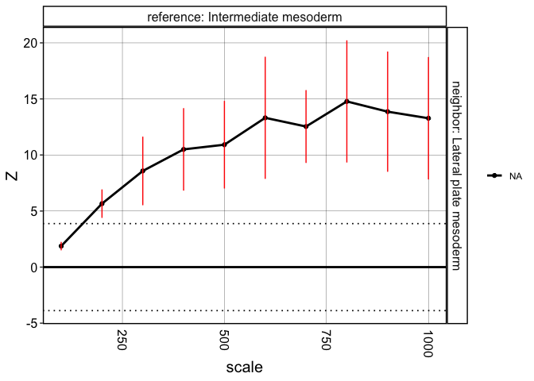

This vignette will go through analyses to reproduce the results and
figures of a mouse embryo SeqFISH dataset.

``` r
library(crawdad)
library(tidyverse)
```

    ## Warning: package 'ggplot2' was built under R version 4.3.1

    ## Warning: package 'dplyr' was built under R version 4.3.1

    ## Warning: package 'stringr' was built under R version 4.3.1

    ## ── Attaching core tidyverse packages ──────────────────────── tidyverse 2.0.0 ──
    ## ✔ dplyr     1.1.4     ✔ readr     2.1.4
    ## ✔ forcats   1.0.0     ✔ stringr   1.5.1
    ## ✔ ggplot2   3.5.1     ✔ tibble    3.2.1
    ## ✔ lubridate 1.9.2     ✔ tidyr     1.3.0
    ## ✔ purrr     1.0.1     
    ## ── Conflicts ────────────────────────────────────────── tidyverse_conflicts() ──
    ## ✖ dplyr::filter() masks stats::filter()
    ## ✖ dplyr::lag()    masks stats::lag()
    ## ℹ Use the conflicted package (<http://conflicted.r-lib.org/>) to force all conflicts to become errors

``` r
ncores = 7
```

# Load data

``` r
data(seq)

## invert coordinates
seq$y <- -seq$y

## convert to sf
seq <- crawdad:::toSF(pos = seq[,c("x", "y")],
                      cellTypes = seq$celltypes)
```

    ## Warning: 'celltypes' does not have levels. Creating levels from values

    ## creating `sf` object

# Visualize celltypes

``` r
crawdad::vizEachCluster(cells = seq,
                        coms = as.factor(seq$celltypes),
                        s = 2)
```


    ## TableGrob (4 x 6) "arrange": 22 grobs
    ##     z     cells    name           grob
    ## 1   1 (1-1,1-1) arrange gtable[layout]
    ## 2   2 (1-1,2-2) arrange gtable[layout]
    ## 3   3 (1-1,3-3) arrange gtable[layout]
    ## 4   4 (1-1,4-4) arrange gtable[layout]
    ## 5   5 (1-1,5-5) arrange gtable[layout]
    ## 6   6 (1-1,6-6) arrange gtable[layout]
    ## 7   7 (2-2,1-1) arrange gtable[layout]
    ## 8   8 (2-2,2-2) arrange gtable[layout]
    ## 9   9 (2-2,3-3) arrange gtable[layout]
    ## 10 10 (2-2,4-4) arrange gtable[layout]
    ## 11 11 (2-2,5-5) arrange gtable[layout]
    ## 12 12 (2-2,6-6) arrange gtable[layout]
    ## 13 13 (3-3,1-1) arrange gtable[layout]
    ## 14 14 (3-3,2-2) arrange gtable[layout]
    ## 15 15 (3-3,3-3) arrange gtable[layout]
    ## 16 16 (3-3,4-4) arrange gtable[layout]
    ## 17 17 (3-3,5-5) arrange gtable[layout]
    ## 18 18 (3-3,6-6) arrange gtable[layout]
    ## 19 19 (4-4,1-1) arrange gtable[layout]
    ## 20 20 (4-4,2-2) arrange gtable[layout]
    ## 21 21 (4-4,3-3) arrange gtable[layout]
    ## 22 22 (4-4,4-4) arrange gtable[layout]

# Make shuffled background

``` r
scales <- seq(100, 1000, by=100)
```

``` r
## generate background
shuffle.list <- crawdad:::makeShuffledCells(seq,
                          scales = scales,
                          perms = 3,
                          ncores = ncores,
                          seed = 1,
                          verbose = TRUE)
```

    ## shuffling permutation 1 using seed 1

    ## 100 unit scale

    ## 176 tiles to shuffle...

    ## shuffling permutation 2 using seed 2

    ## 100 unit scale

    ## 204 tiles to shuffle...

    ## shuffling permutation 3 using seed 3

    ## 100 unit scale

    ## 204 tiles to shuffle...

    ## shuffling permutation 1 using seed 1

    ## 200 unit scale

    ## 48 tiles to shuffle...

    ## shuffling permutation 2 using seed 2

    ## 200 unit scale

    ## 54 tiles to shuffle...

    ## shuffling permutation 3 using seed 3

    ## 200 unit scale

    ## 63 tiles to shuffle...

    ## shuffling permutation 1 using seed 1

    ## 300 unit scale

    ## 24 tiles to shuffle...

    ## shuffling permutation 2 using seed 2

    ## 300 unit scale

    ## 24 tiles to shuffle...

    ## shuffling permutation 3 using seed 3

    ## 300 unit scale

    ## 30 tiles to shuffle...

    ## shuffling permutation 1 using seed 1

    ## 400 unit scale

    ## 12 tiles to shuffle...

    ## shuffling permutation 2 using seed 2

    ## 400 unit scale

    ## 20 tiles to shuffle...

    ## shuffling permutation 3 using seed 3

    ## 400 unit scale

    ## 20 tiles to shuffle...

    ## shuffling permutation 1 using seed 1

    ## 500 unit scale

    ## 12 tiles to shuffle...

    ## shuffling permutation 2 using seed 2

    ## 500 unit scale

    ## 12 tiles to shuffle...

    ## shuffling permutation 3 using seed 3

    ## 500 unit scale

    ## 12 tiles to shuffle...

    ## shuffling permutation 1 using seed 1

    ## 600 unit scale

    ## 6 tiles to shuffle...

    ## shuffling permutation 2 using seed 2

    ## 600 unit scale

    ## 9 tiles to shuffle...

    ## shuffling permutation 3 using seed 3

    ## 600 unit scale

    ## 12 tiles to shuffle...

    ## shuffling permutation 1 using seed 1

    ## 700 unit scale

    ## 6 tiles to shuffle...

    ## shuffling permutation 2 using seed 2

    ## 700 unit scale

    ## 6 tiles to shuffle...

    ## shuffling permutation 3 using seed 3

    ## 700 unit scale

    ## 9 tiles to shuffle...

    ## shuffling permutation 1 using seed 1

    ## 800 unit scale

    ## 4 tiles to shuffle...

    ## shuffling permutation 2 using seed 2

    ## 800 unit scale

    ## 6 tiles to shuffle...

    ## shuffling permutation 3 using seed 3

    ## 800 unit scale

    ## 9 tiles to shuffle...

    ## shuffling permutation 1 using seed 1

    ## 900 unit scale

    ## 4 tiles to shuffle...

    ## shuffling permutation 2 using seed 2

    ## 900 unit scale

    ## 6 tiles to shuffle...

    ## shuffling permutation 3 using seed 3

    ## 900 unit scale

    ## 6 tiles to shuffle...

    ## shuffling permutation 1 using seed 1

    ## 1000 unit scale

    ## 4 tiles to shuffle...

    ## shuffling permutation 2 using seed 2

    ## 1000 unit scale

    ## 4 tiles to shuffle...

    ## shuffling permutation 3 using seed 3

    ## 1000 unit scale

    ## 6 tiles to shuffle...

    ## Time was 0.72 mins

``` r
## note: 1.94 minutes with 7 M2 cores
```

# Run pairwise analysis

``` r
## find trends, passing background as parameter
results <- crawdad::findTrends(seq,
                        neighDist = 50,
                        shuffleList = shuffle.list,
                        ncores = ncores,
                        verbose = TRUE,
                        returnMeans = FALSE)
```

    ## Evaluating significance for each cell type

    ## using neighbor distance of 50

    ## Calculating for pairwise combinations

    ## Allantois

    ## Anterior somitic tissues

    ## Cardiomyocytes

    ## Cranial mesoderm

    ## Definitive endoderm

    ## Dermomyotome

    ## Endothelium

    ## Erythroid

    ## Forebrain/Midbrain/Hindbrain

    ## Gut tube

    ## Haematoendothelial progenitors

    ## Intermediate mesoderm

    ## Lateral plate mesoderm

    ## Low quality

    ## Mixed mesenchymal mesoderm

    ## Neural crest

    ## NMP

    ## Presomitic mesoderm

    ## Sclerotome

    ## Spinal cord

    ## Splanchnic mesoderm

    ## Surface ectoderm

    ## Time was 2.86 mins

``` r
## note: 1.73 minutes with 7 M2 cores
```

``` r
## convert results to data.frame
dat <- crawdad::meltResultsList(results, withPerms = T)
```

# Visualize results

``` r
## calculate the zscore for the multiple-test correction
zsig <- correctZBonferroni(dat)
```

Summary visualization of CRAWDAD’s multi-scale cell-type spatial
relationship analysis.

``` r
vizColocDotplot(dat, reorder = TRUE, 
                zSigThresh = zsig, zScoreLimit = zsig*2, 
                dotSizes = c(1,11)) +
  theme(legend.position='right',
        axis.text.x = element_text(angle = 45, h = 0))
```

    ## this function will be deprecated, use vizRelationships instead

    ## Scale for x is already present.
    ## Adding another scale for x, which will replace the existing scale.


Visualize specific trends.

``` r
dat_filter <- dat %>% 
  filter(reference == 'Endothelium') %>% 
  filter(neighbor == 'Haematoendothelial progenitors')
vizTrends(dat_filter, lines = T, withPerms = T, zSigThresh = zsig)
```


``` r
dat_filter <- dat %>% 
  filter(reference == 'Intermediate mesoderm') %>% 
  filter(neighbor == 'Lateral plate mesoderm')
vizTrends(dat_filter, lines = T, withPerms = T, zSigThresh = zsig)
```


