This vignette will go through analyses to reproduce the results and
figures of the Slide-seq dataset.

``` r
library(crawdad)
library(dplyr)
```

``` r
ncores = 2
```

# Load data

``` r
slide <- read.csv2(file = paste0(here::here(), "/data/slideseq/slideseq.puck190926_08.rctd.meta.csv.gz"), row.names = 1, sep = ",")
slide <- slide[,c("x", "y", "class")]
## make sure the coordinates are numeric
slide <- slide %>%
  dplyr::mutate_at(vars(x, y), as.numeric)

## convert to SP
slide <- crawdad:::toSP(pos = slide[,c("x", "y")],
                        celltypes = slide$class)
slide
```

``` r
## the above dataset has been saved as an rda file and able to load here:
data(slide)

## convert to SP
slide <- crawdad:::toSP(pos = slide[,c("x", "y")],
                        celltypes = slide$celltypes)
```

    ## Warning: 'celltypes' does not have levels. Creating levels from values

    ## creating `sp::SpatialPointsDataFrame`

``` r
slide
```

    ## Simple feature collection with 10098 features and 1 field
    ## Attribute-geometry relationship: 1 constant, 0 aggregate, 0 identity
    ## Geometry type: POINT
    ## Dimension:     XY
    ## Bounding box:  xmin: 932.8308 ymin: 1057.368 xmax: 5561.381 ymax: 4857.833
    ## CRS:           NA
    ## First 10 features:
    ##           celltypes                  geometry
    ## 1          Bergmann POINT (1632.575 3463.375)
    ## 2          Bergmann  POINT (2444.101 3211.56)
    ## 3        Fibroblast POINT (3076.576 2494.061)
    ## 4              MLI2  POINT (4916.06 1439.224)
    ## 5           Granule POINT (3078.089 1795.178)
    ## 6        Astrocytes POINT (4682.637 2342.198)
    ## 7  Oligodendrocytes POINT (4178.564 2645.021)
    ## 8           Granule      POINT (2897.31 2457)
    ## 9          Purkinje POINT (2097.519 3154.436)
    ## 10       Astrocytes  POINT (2689.262 1708.35)

# Visualize celltypes

``` r
crawdad::vizEachCluster(cells = slide,
                        coms = as.factor(slide$celltypes),
                        s = 2)
```

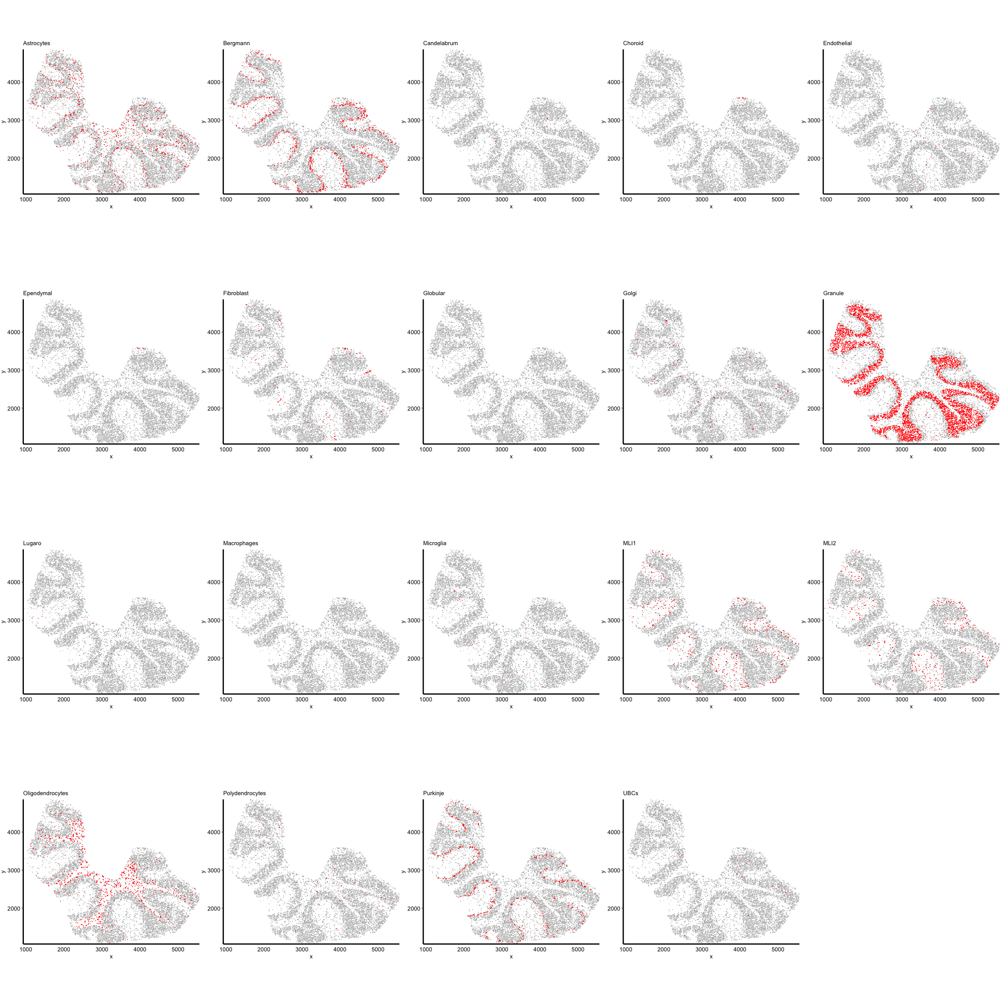

    ## TableGrob (4 x 5) "arrange": 19 grobs
    ##     z     cells    name           grob
    ## 1   1 (1-1,1-1) arrange gtable[layout]
    ## 2   2 (1-1,2-2) arrange gtable[layout]
    ## 3   3 (1-1,3-3) arrange gtable[layout]
    ## 4   4 (1-1,4-4) arrange gtable[layout]
    ## 5   5 (1-1,5-5) arrange gtable[layout]
    ## 6   6 (2-2,1-1) arrange gtable[layout]
    ## 7   7 (2-2,2-2) arrange gtable[layout]
    ## 8   8 (2-2,3-3) arrange gtable[layout]
    ## 9   9 (2-2,4-4) arrange gtable[layout]
    ## 10 10 (2-2,5-5) arrange gtable[layout]
    ## 11 11 (3-3,1-1) arrange gtable[layout]
    ## 12 12 (3-3,2-2) arrange gtable[layout]
    ## 13 13 (3-3,3-3) arrange gtable[layout]
    ## 14 14 (3-3,4-4) arrange gtable[layout]
    ## 15 15 (3-3,5-5) arrange gtable[layout]
    ## 16 16 (4-4,1-1) arrange gtable[layout]
    ## 17 17 (4-4,2-2) arrange gtable[layout]
    ## 18 18 (4-4,3-3) arrange gtable[layout]
    ## 19 19 (4-4,4-4) arrange gtable[layout]

# Make shuffled background

``` r
resolutions <- c(100, 200, 300, 400, 500, 600, 700, 800, 900, 1000, 1200, 1500, 3000, 6000)
```

``` r
oldw <- getOption("warn")
options(warn = -1)

## generate background
shuffle.list <- crawdad:::makeShuffledCells(slide,
                          resolutions = resolutions,
                          perms = 1,
                          ncores = ncores,
                          seed = 1,
                          verbose = TRUE)

options(warn = oldw)

## note: 0.34 minutes with 7 cores, 2.3 GHz Quad-Core Intel Core i7
```

save shuffled object

``` r
saveRDS(shuffle.list, paste0(here::here(), "/data/slideseq/slideseqPuck.190926_08.shuffled_res100-6000.rds"))

## slideseqPuck.190926_08.rctd.shuffled_res30-6000.rds
```

# Run pairwise analysis

``` r
oldw <- getOption("warn")
options(warn = -1)

## find trends, passing background as parameter
results <- crawdad::findTrends(slide,
                        dist = 100,
                        shuffle.list = shuffle.list,
                        ncores = ncores,
                        verbose = TRUE)


options(warn = oldw)

## note: 1.3 minutes with 7 cores, 2.3 GHz Quad-Core Intel Core i7
```

save pairwise results object

``` r
saveRDS(results, paste0(here::here(), "/data/slideseq/slideseqPuck.190926_08.pairwise.results.dist100.res100-6000.rds"))

## object with distances 30-300: slideseqPuck.190926_08.rctd.pairwise.30-300.results.removeDups.rds
```

# Filter trends

``` r
table(slide$celltypes)
```

    ## 
    ##       Astrocytes         Bergmann      Candelabrum          Choroid 
    ##              823              933               17               11 
    ##      Endothelial        Ependymal       Fibroblast         Globular 
    ##               39               10              126                4 
    ##            Golgi          Granule           Lugaro      Macrophages 
    ##               92             5643               30                3 
    ##        Microglia             MLI1             MLI2 Oligodendrocytes 
    ##               29              446              353              886 
    ##  Polydendrocytes         Purkinje             UBCs 
    ##               53              571               29

Ignore poorly represented cell types like: Choroid, Candelabrum,
Ependymal, Globular, Macrophages

``` r
results <- readRDS(paste0(here::here(), "/data/slideseq/slideseqPuck.190926_08.pairwise.results.dist100.res100-6000.rds"))

results.coloc <- crawdad::filterCoTrends(results = results, alpha = 0.05)
results.sep <- crawdad::filterSepTrends(results = results, alpha = 0.05)
results.change <- crawdad::filterChangeTrends(results = results, alpha = 0.05)
```

``` r
## example: neighbor cell types that are significantly co-localized or separated with Purkinje at some scale
results.coloc$`Purkinje`
```

    ##      Astrocytes   Bergmann        MLI1        MLI2 Purkinje
    ## 100   0.5812040  0.3410449  0.28719946 -0.19686415 0.031308
    ## 200   0.6502092  2.5967782 -0.04078694 -0.58540039 2.452165
    ## 300   1.2773963  6.5826008  0.74463191 -0.48890399 4.573463
    ## 400   1.6662634  6.6418431  1.38095911 -0.87240045 6.081165
    ## 500   0.7886242  6.9987737  1.16719773 -1.10877804 7.272596
    ## 600   0.9275831  8.6066569  1.85724564 -0.09865226 8.661351
    ## 700   2.2397515 10.2055555  2.88122239  0.14881445 7.538484
    ## 800   1.0670914  8.9160268  2.56540735 -0.04938147 8.037515
    ## 900   0.9624084  9.9512078  3.89902783  1.01182362 9.456771
    ## 1000  1.8087503  9.6666722  2.97214809  0.96009712 9.942720
    ## 1200  1.1020550 11.0741569  3.15493968  2.01906147 8.779539
    ## 1500  2.2397515 10.9768554  2.83587595  0.44951350 9.336318
    ## 3000  1.0670914  9.8245391  4.42311238  0.70330372 9.942720
    ## 6000  1.5597791 11.3672725  3.20083532  0.65230809 9.136467

``` r
results.sep$`Purkinje`
```

    ##         Choroid Fibroblast     Granule Oligodendrocytes
    ## 100  -0.4473174 -0.7535262 -0.03854138        -1.777820
    ## 200  -0.4473174 -1.3538910 -1.07894174        -5.760238
    ## 300   0.5774306 -2.0994381 -3.85319139        -9.115132
    ## 400   0.5774306 -2.8750970 -3.96884125       -11.091448
    ## 500  -0.4473174 -2.7918494 -4.31584190       -11.020062
    ## 600   0.0000000 -3.2813194 -5.35740411       -13.102089
    ## 700  -1.8982474 -2.9576593 -6.80588721       -13.297164
    ## 800   0.0000000 -3.4393701 -5.16444972       -13.746281
    ## 900  -1.4147387 -3.4393701 -6.78655663       -14.651251
    ## 1000 -1.6673630 -2.8750970 -7.52150326       -13.618809
    ## 1200 -0.8167239 -2.6232423 -7.85056813       -13.967770
    ## 1500 -2.1116573 -2.7079026 -8.52864145       -12.607269
    ## 3000 -1.6673630 -2.6232423 -7.11524891       -14.864880
    ## 6000 -1.6673630 -3.5174917 -7.38605677       -14.404871

``` r
ignore <- c("Choroid", "Candelabrum", "Ependymal", "Globular", "Macrophages")

length(unlist(lapply(names(results.coloc), function(ct){
  if(!ct %in% ignore){
    df <- results.coloc[[ct]]
    cts <- setdiff(colnames(df), ignore)
    return(cts)
  } else {
    NULL
  }
})))
```

    ## [1] 60

``` r
length(unlist(lapply(names(results.sep), function(ct){
  if(!ct %in% ignore){
    df <- results.sep[[ct]]
    cts <- setdiff(colnames(df), ignore)
    return(cts)
  } else {
    NULL
  }
})))
```

    ## [1] 62

``` r
length(unlist(lapply(names(results.change), function(ct){
  if(!ct %in% ignore){
    df <- results.change[[ct]]
    cts <- setdiff(colnames(df), ignore)
    return(cts)
  } else {
    NULL
  }
})))
```

    ## [1] 0

# Defining subsets

``` r
oldw <- getOption("warn")
options(warn = -1)

binomMat <- crawdad::binomialTestMatrix(slide,
                               neigh.dist = 100,
                               ncores = ncores,
                               verbose = TRUE)

head(binomMat)

options(warn = oldw)

## note: 0.8 minutes with 7 cores, 2.3 GHz Quad-Core Intel Core i7
## previous code iteration on rockfish took 3:56 minutes with 32 cores! much better now 
```

save the binomial matrix

``` r
saveRDS(binomMat, paste0(here::here(), "/data/slideseq/slideseqPuck.190926_08.binomMat.near.subdist100.rds"))
```

``` r
oldw <- getOption("warn")
options(warn = -1)

subset.list <- crawdad::selectSubsets(binomMat,
                             slide$celltypes,
                             sub.type = "near",
                             sub.thresh = 0.05,
                             ncores = ncores,
                             verbose = TRUE)

options(warn = oldw)
```

save the subsets

``` r
saveRDS(subset.list, paste0(here::here(), "/data/slideseq/slideseqPuck.190926_08.subsets.near.subdist100.rds"))

## slideseqPuck.190926_08.rctd.subsets.near.subdist100.rds
```

# Run analysis on subsets

``` r
oldw <- getOption("warn")
options(warn = -1)

results.subsets <- crawdad::findTrends(slide,
                        dist = 100,
                        shuffle.list = shuffle.list,
                        subset.list = subset.list,
                        ncores = ncores,
                        verbose = TRUE)

options(warn = oldw)

## note: 27.85 minutes with 7 cores, 2.3 GHz Quad-Core Intel Core i7; vs 2:46 minutes 14 cores on rockfish
```

save the results

``` r
saveRDS(results.subsets, paste0(here::here(), "/data/slideseq/slideseqPuck.190926_08.subset.results.dist100.res100-6000.rds"))

## slideseqPuck.190926_08.rctd.near.binom.subdist100.dist100.results.removeDups.rds
```

# ———————————

# Figures

## load data

``` r
## folder on `brendan` branch
figpath <- paste0(here::here(), "/plots/slideseq")

shuffle.list <- readRDS(paste0(here::here(), "/data/slideseq/slideseqPuck.190926_08.shuffled_res100-6000.rds"))

binomMat <- readRDS(paste0(here::here(), "/data/slideseq/slideseqPuck.190926_08.binomMat.near.subdist100.rds"))
subset.list <- readRDS(paste0(here::here(), "/data/slideseq/slideseqPuck.190926_08.subsets.near.subdist100.rds"))

results <- readRDS(paste0(here::here(), "/data/slideseq/slideseqPuck.190926_08.pairwise.results.dist100.res100-6000.rds"))
results.subsets <- readRDS(paste0(here::here(), "/data/slideseq/slideseqPuck.190926_08.subset.results.dist100.res100-6000.rds"))
```

## Fig 2 - tissue

``` r
plt <- crawdad::vizAllClusters(cells = slide,
                        coms = as.factor(slide$celltypes),
                        ofInterest = c("Bergmann", "MLI1", "MLI2", "Purkinje"),
                        s = 2) +
  # ggplot2::theme(legend.position="none")
  ggplot2::guides(colour = ggplot2::guide_legend(override.aes = list(size=2), ncol = 1))
plt
```

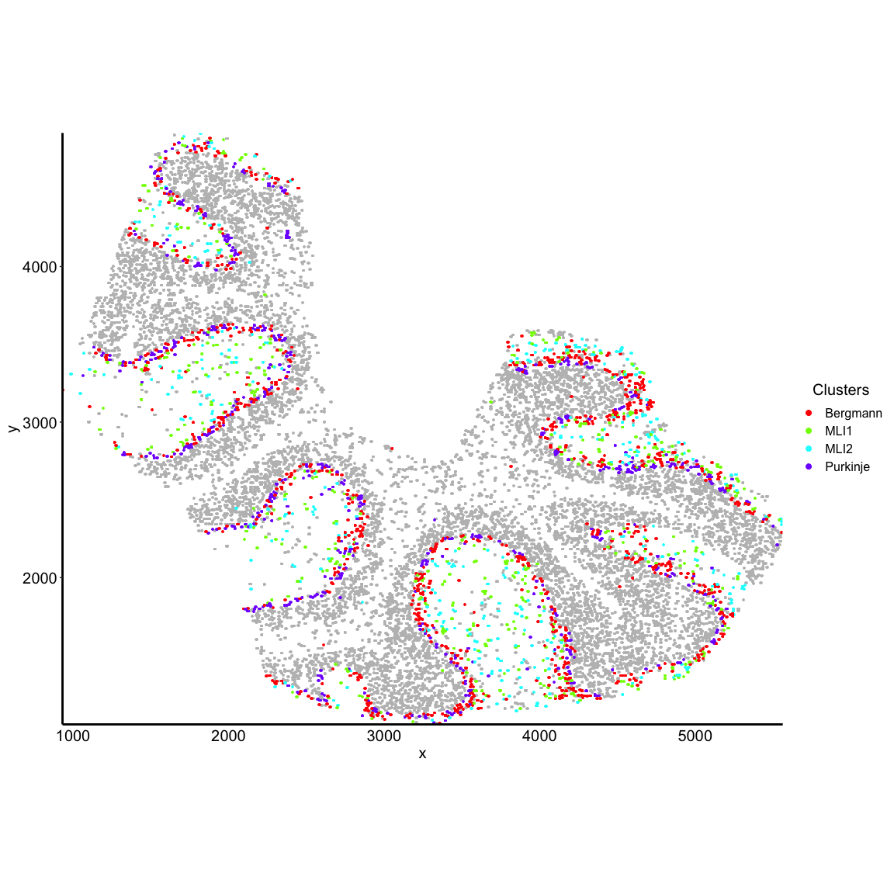

``` r
# ggplot2::ggsave(filename = "2_slideseq_purk_berg_tissue_legend.pdf",
#                 plot = plt,
#                 device = "pdf",
#                 path = figpath,
#                 scale = 1,
#                 width = 6,
#                 height = 6,
#                 units = c("in"))
```

``` r
plt <- crawdad::vizAllClusters(cells = slide,
                        coms = as.factor(slide$celltypes),
                        ofInterest = c("Bergmann", "MLI1", "MLI2", "Purkinje", "Granule", "Oligodendrocytes"),
                        s = 2) +
  # ggplot2::theme(legend.position="none")
  ggplot2::guides(colour = ggplot2::guide_legend(override.aes = list(size=2), ncol = 1))
plt
```

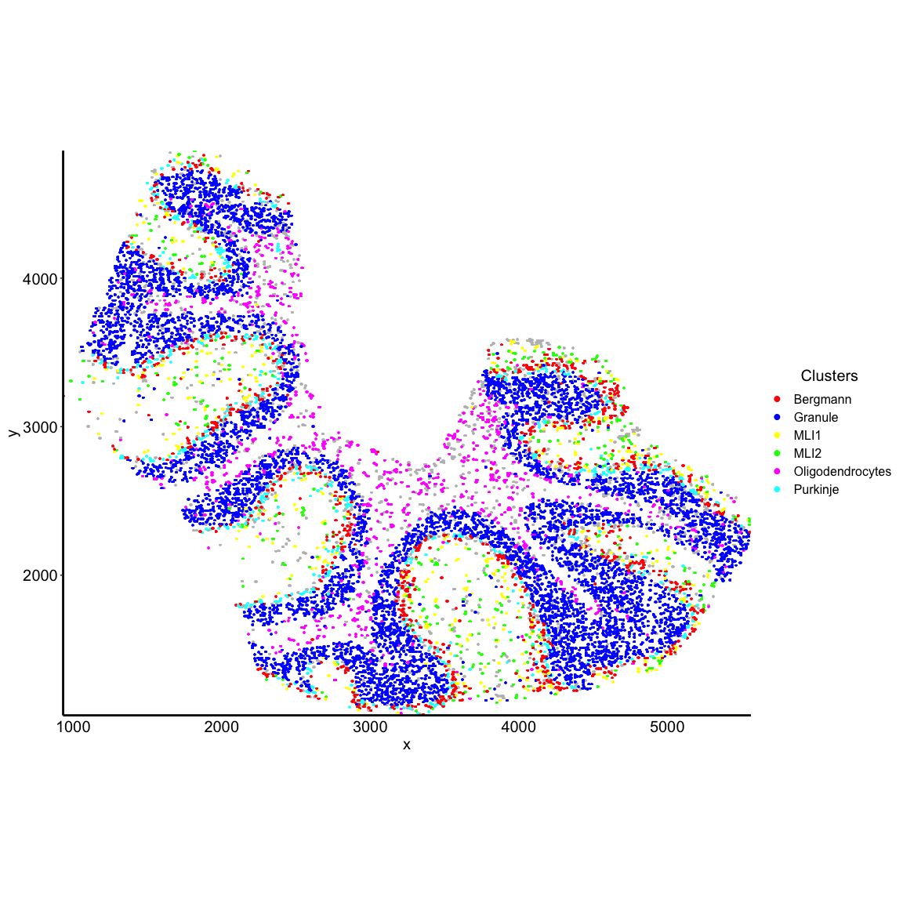

``` r
# ggplot2::ggsave(filename = "S1_slideseq_purk_berg_tissue_sep_legend.pdf",
#                 plot = plt,
#                 device = "pdf",
#                 path = figpath,
#                 scale = 1,
#                 width = 6,
#                 height = 6,
#                 units = c("in"))
```

``` r
crawdad::vizAllClusters(cells = slide,
                        coms = as.factor(slide$celltypes),
                        ofInterest = c("Bergmann", "MLI1", "Purkinje"),
                        s = 2)
```

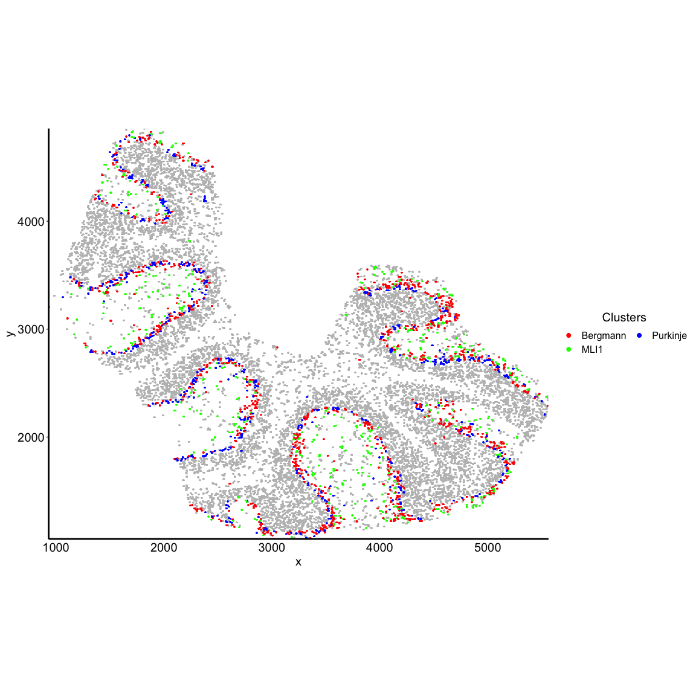

``` r
## shuffling grid
grid <- sf::st_make_grid(slide, cellsize = 1000)
grid_coords <- as.data.frame(sf::st_coordinates(grid))

## centers of the grids to add the tile IDs
grid_coords_centroids <- as.data.frame(sf::st_coordinates(sf::st_centroid(grid)))
grid_coords_centroids$name <- as.character(rownames(grid_coords_centroids))


plt <- crawdad::vizAllClusters(cells = slide,
                        coms = as.factor(slide$celltypes),
                        ofInterest = c("Bergmann", "MLI1", "MLI2", "Purkinje"),
                        s = 2) +
  ggplot2::theme(legend.position="none") +
  # ggplot2::guides(colour = ggplot2::guide_legend(override.aes = list(size=2), ncol = 1))
  
  ## add in the grid information on top of the plot
  ggplot2::geom_sf(data = grid, fill = NA) 
  # ggplot2::geom_text(data = grid_coords_centroids, ggplot2::aes(X, Y, label = name))

ggplot2::ggsave(filename = "2A_slideseq_purk_berg_tissue_grid.pdf",
                plot = plt,
                device = "pdf",
                path = figpath,
                scale = 1,
                width = 6,
                height = 6,
                units = c("in"))
  
plt
```

``` r
## pull out cells in specific grid regions
int <- sf::st_intersection(slide, grid[[14]])
cells2 <- slide[rownames(int),]

## grid 11 real
plt <- crawdad::vizAllClusters(cells = cells2,
                               coms = cells2$celltypes,
                               ofInterest = c("Bergmann", "MLI1", "MLI2", "Purkinje"),
                               title = "grid14",
                               axisAdj = 1, s = 10, a = 0.5) +
  # ggplot2::guides(colour = ggplot2::guide_legend(override.aes = list(size=2), ncol = 1)) +
  ggplot2::theme(legend.position="none") +
  ggplot2::labs(x = "x",
                y = "y")
plt

# ggplot2::ggsave(filename = "2_slideseq_purk_berg_tissue_zoom.pdf",
#                 plot = plt,
#                 device = "pdf",
#                 path = figpath,
#                 scale = 1,
#                 width = 6,
#                 height = 6,
#                 units = c("in"))
```

``` r
## pull out cells in specific grid regions
int <- sf::st_intersection(slide, grid[[14]])
cells2 <- slide[rownames(int),]

## grid 11 real
plt <- crawdad::vizAllClusters(cells = cells2,
                               coms = cells2$celltypes,
                               ofInterest = c("Bergmann", "MLI1", "MLI2", "Purkinje", "Granule", "Oligodendrocytes"),
                               title = "grid14",
                               axisAdj = 1, s = 10, a = 0.5) +
  # ggplot2::guides(colour = ggplot2::guide_legend(override.aes = list(size=2), ncol = 1)) +
  ggplot2::theme(legend.position="none") +
  ggplot2::labs(x = "x",
                y = "y")
plt

# ggplot2::ggsave(filename = "2_slideseq_purk_berg_tissue_sep_zoom.pdf",
#                 plot = plt,
#                 device = "pdf",
#                 path = figpath,
#                 scale = 1,
#                 width = 6,
#                 height = 6,
#                 units = c("in"))
```

## Fig 2 - trends

### all

``` r
ignore <- c("Choroid", "Candelabrum", "Ependymal", "Globular", "Macrophages")

dat <- crawdad::meltResultsList(results)

dat <- dat[!dat$reference %in% c(ignore) & !dat$neighbor %in% c(ignore),]

plt <- vizTrends.heatmap(dat = dat, annotation = FALSE)
plt
```

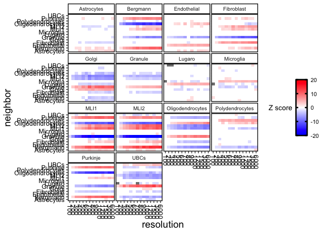

``` r
# ggplot2::ggsave(filename = "2_slideseq_all_trends_heatmap.pdf",
#                 plot = plt,
#                 device = "pdf",
#                 path = figpath,
#                 scale = 1,
#                 width = 12,
#                 height = 10,
#                 units = c("in"))
```

### Purkinje

``` r
dat <- crawdad::meltResultsList(results)

d1 <- dat[dat$reference == "Purkinje" & dat$neighbor == "Bergmann",]
d2 <- dat[dat$reference == "Purkinje" & dat$neighbor == "MLI1",]
d3 <- dat[dat$reference == "Purkinje" & dat$neighbor == "MLI2",]

## combine the trends into one data.frame, and have the "id" column label the combo, plot both lines on same plot
## turn off the facet wrap so just coloring the two trends, which are labeled using the "id" column

d1$id <- "Bergmann"
d2$id <- "MLI1"
d3$id <- "MLI2"

d <- dplyr::bind_rows(list(d1, d2, d3))

plt <- vizTrends(dat = d, facet = FALSE) +
  ggplot2::scale_x_log10() +
  # ggplot2::theme(legend.position="none") +
  ggplot2::ggtitle("Purkinje")
plt 
```

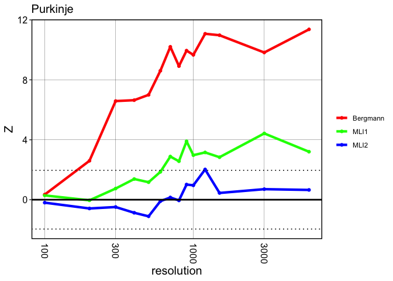

``` r
# ggplot2::ggsave(filename = "2_slideseq_purkinje_trends.pdf",
#                 plot = plt,
#                 device = "pdf",
#                 path = figpath,
#                 scale = 1,
#                 width = 4,
#                 height = 4,
#                 units = c("in"))
```

``` r
dat <- crawdad::meltResultsList(results)

d1 <- dat[dat$reference == "Purkinje" & dat$neighbor == "Granule",]
d2 <- dat[dat$reference == "Purkinje" & dat$neighbor == "Oligodendrocytes",]

## combine the trends into one data.frame, and have the "id" column label the combo, plot both lines on same plot
## turn off the facet wrap so just coloring the two trends, which are labeled using the "id" column

d1$id <- "Granule"
d2$id <- "Oligodendrocytes"

d <- dplyr::bind_rows(list(d1, d2))

plt <- vizTrends(dat = d, facet = FALSE) +
  ggplot2::scale_x_log10() +
  # ggplot2::theme(legend.position="none") +
  ggplot2::ggtitle("Purkinje")
plt 
```

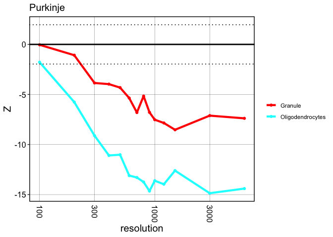

``` r
# ggplot2::ggsave(filename = "2_slideseq_purkinje_trends_sep.pdf",
#                 plot = plt,
#                 device = "pdf",
#                 path = figpath,
#                 scale = 1,
#                 width = 4,
#                 height = 4,
#                 units = c("in"))
```

``` r
dat <- crawdad::meltResultsList(results)

d1 <- dat[dat$reference == "Purkinje",]
plt <- vizTrends(dat = d1, facet = FALSE, id = "neighbor") +
  ggplot2::scale_x_log10() +
  ggplot2::ggtitle("Purkinje")
plt
```

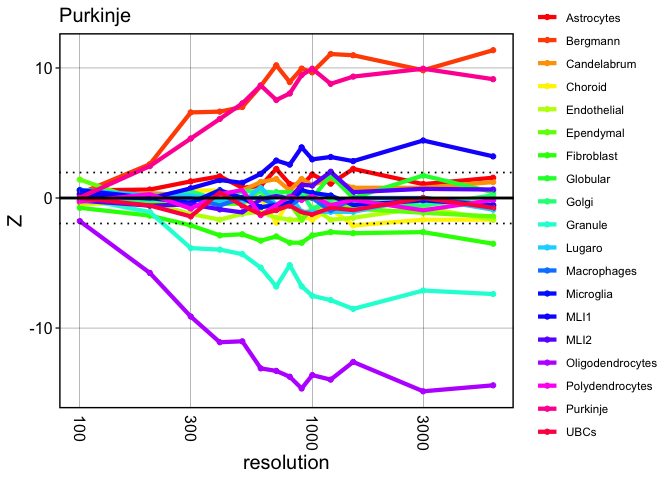

``` r
# ggplot2::ggsave(filename = "S3_slideseq_purkinje_trends_all.pdf",
#                 plot = plt,
#                 device = "pdf",
#                 path = figpath,
#                 scale = 1,
#                 width = 6,
#                 height = 6,
#                 units = c("in"))
```

### Bergmann

``` r
dat <- crawdad::meltResultsList(results)

d1 <- dat[dat$reference == "Bergmann" & dat$neighbor == "Purkinje",]
d2 <- dat[dat$reference == "Bergmann" & dat$neighbor == "MLI1",]
d3 <- dat[dat$reference == "Bergmann" & dat$neighbor == "MLI2",]

## combine the trends into one data.frame, and have the "id" column label the combo, plot both lines on same plot
## turn off the facet wrap so just coloring the two trends, which are labeled using the "id" column

d1$id <- "Purkinje"
d2$id <- "MLI1"
d3$id <- "MLI2"

d <- dplyr::bind_rows(list(d1, d2, d3))

plt <- vizTrends(dat = d, facet = FALSE) +
  ggplot2::scale_x_log10() +
  # ggplot2::theme(legend.position="none") +
  ggplot2::ggtitle("Bergmann")
plt 
```

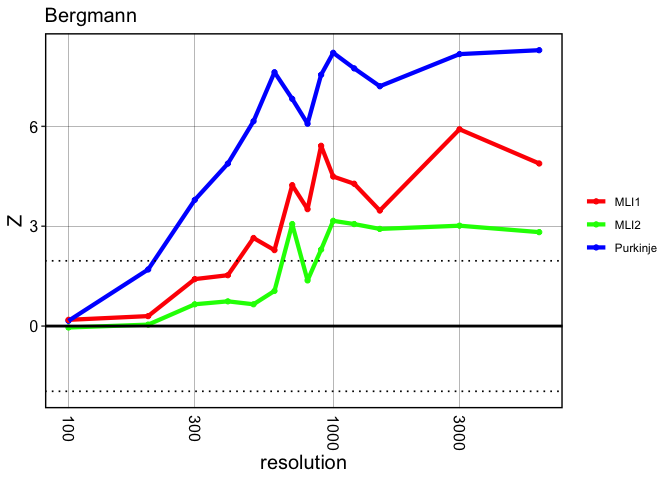

``` r
# ggplot2::ggsave(filename = "2_slideseq_bergmann_trends.pdf",
#                 plot = plt,
#                 device = "pdf",
#                 path = figpath,
#                 scale = 1,
#                 width = 4,
#                 height = 4,
#                 units = c("in"))
```

``` r
dat <- crawdad::meltResultsList(results)

d1 <- dat[dat$reference == "Bergmann",]
plt <- vizTrends(dat = d1, facet = FALSE, id = "neighbor") +
  ggplot2::scale_x_log10() +
  ggplot2::ggtitle("Bergmann")
plt
```

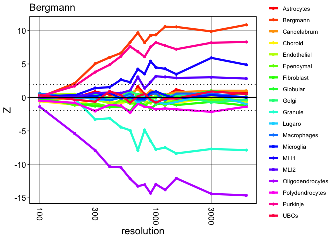

``` r
# ggplot2::ggsave(filename = "S3_slideseq_bergmann_trends_all.pdf",
#                 plot = plt,
#                 device = "pdf",
#                 path = figpath,
#                 scale = 1,
#                 width = 6,
#                 height = 6,
#                 units = c("in"))
```

### MLI1

``` r
dat <- crawdad::meltResultsList(results)

d1 <- dat[dat$reference == "MLI1" & dat$neighbor == "Purkinje",]
d2 <- dat[dat$reference == "MLI1" & dat$neighbor == "Bergmann",]
d3 <- dat[dat$reference == "MLI1" & dat$neighbor == "MLI2",]

## combine the trends into one data.frame, and have the "id" column label the combo, plot both lines on same plot
## turn off the facet wrap so just coloring the two trends, which are labeled using the "id" column

d1$id <- "Purkinje"
d2$id <- "Bergmann"
d3$id <- "MLI2"

d <- dplyr::bind_rows(list(d1, d2, d3))

plt <- vizTrends(dat = d, facet = FALSE) +
  ggplot2::scale_x_log10() +
  # ggplot2::theme(legend.position="none") +
  ggplot2::ggtitle("MLI1")
plt 
```

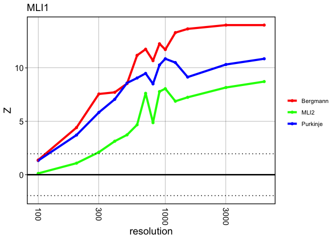

``` r
# ggplot2::ggsave(filename = "2_slideseq_mli1_trends.pdf",
#                 plot = plt,
#                 device = "pdf",
#                 path = figpath,
#                 scale = 1,
#                 width = 4,
#                 height = 4,
#                 units = c("in"))
```

``` r
dat <- crawdad::meltResultsList(results)

d1 <- dat[dat$reference == "MLI1",]
plt <- vizTrends(dat = d1, facet = FALSE, id = "neighbor") +
  ggplot2::scale_x_log10() +
  ggplot2::ggtitle("MLI1")
plt
```

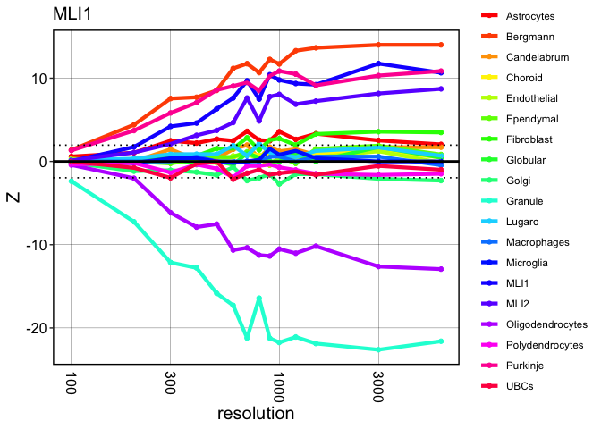

``` r
# ggplot2::ggsave(filename = "S3_slideseq_mli1_trends_all.pdf",
#                 plot = plt,
#                 device = "pdf",
#                 path = figpath,
#                 scale = 1,
#                 width = 6,
#                 height = 6,
#                 units = c("in"))
```

### MLI2

``` r
dat <- crawdad::meltResultsList(results)

d1 <- dat[dat$reference == "MLI2" & dat$neighbor == "Purkinje",]
d2 <- dat[dat$reference == "MLI2" & dat$neighbor == "Bergmann",]
d3 <- dat[dat$reference == "MLI2" & dat$neighbor == "MLI1",]

## combine the trends into one data.frame, and have the "id" column label the combo, plot both lines on same plot
## turn off the facet wrap so just coloring the two trends, which are labeled using the "id" column

d1$id <- "Purkinje"
d2$id <- "Bergmann"
d3$id <- "MLI1"

d <- dplyr::bind_rows(list(d1, d2, d3))

plt <- vizTrends(dat = d, facet = FALSE) +
  ggplot2::scale_x_log10() +
  # ggplot2::theme(legend.position="none") +
  ggplot2::ggtitle("MLI2")
plt 
```

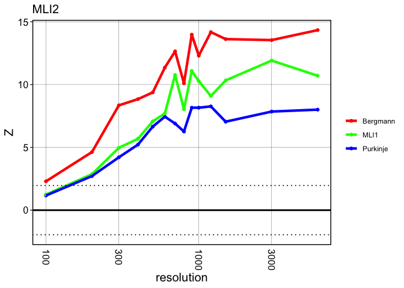

``` r
# ggplot2::ggsave(filename = "2_slideseq_mli2_trends.pdf",
#                 plot = plt,
#                 device = "pdf",
#                 path = figpath,
#                 scale = 1,
#                 width = 4,
#                 height = 4,
#                 units = c("in"))
```

``` r
dat <- crawdad::meltResultsList(results)

d1 <- dat[dat$reference == "MLI2",]
plt <- vizTrends(dat = d1, facet = FALSE, id = "neighbor") +
  ggplot2::scale_x_log10() +
  ggplot2::ggtitle("MLI2")
plt
```

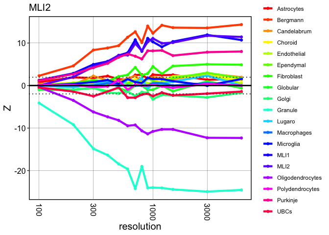

``` r
# ggplot2::ggsave(filename = "S3_slideseq_mli2_trends_all.pdf",
#                 plot = plt,
#                 device = "pdf",
#                 path = figpath,
#                 scale = 1,
#                 width = 6,
#                 height = 6,
#                 units = c("in"))
```

## combine heatmaps

``` r
dat <- crawdad::meltResultsList(results)
d <- dat[dat$reference %in% c("Bergmann", "MLI1", "MLI2", "Purkinje") & dat$neighbor %in% c("Bergmann", "MLI1", "MLI2", "Purkinje"),]

plt <- vizTrends.heatmap(dat = d)
plt
```

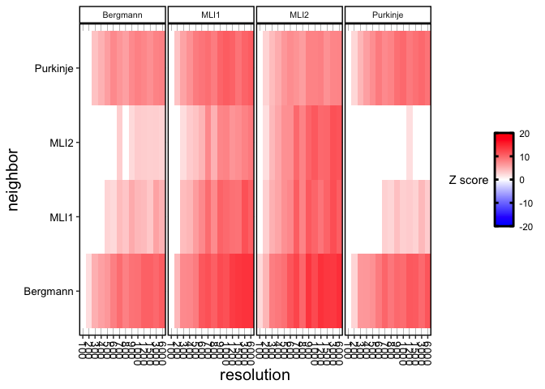

``` r
# ggplot2::ggsave(filename = "2_slideseq_purk_berg_mli_trends_heatmap.pdf",
#                 plot = plt,
#                 device = "pdf",
#                 path = figpath,
#                 scale = 1,
#                 width = 8,
#                 height = 6,
#                 units = c("in"))
```

``` r
dat <- crawdad::meltResultsList(results)
d <- dat[dat$reference %in% c("Bergmann", "MLI1", "MLI2", "Purkinje"),]

plt <- vizTrends.heatmap(dat = d)
plt
```

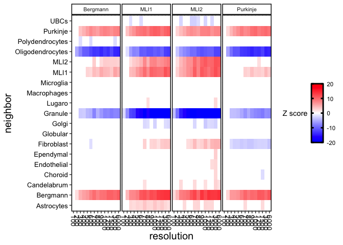

``` r
# ggplot2::ggsave(filename = "S1_slideseq_purk_berg_mli_trends_heatmap_all.pdf",
#                 plot = plt,
#                 device = "pdf",
#                 path = figpath,
#                 scale = 1,
#                 width = 8,
#                 height = 6,
#                 units = c("in"))
```
