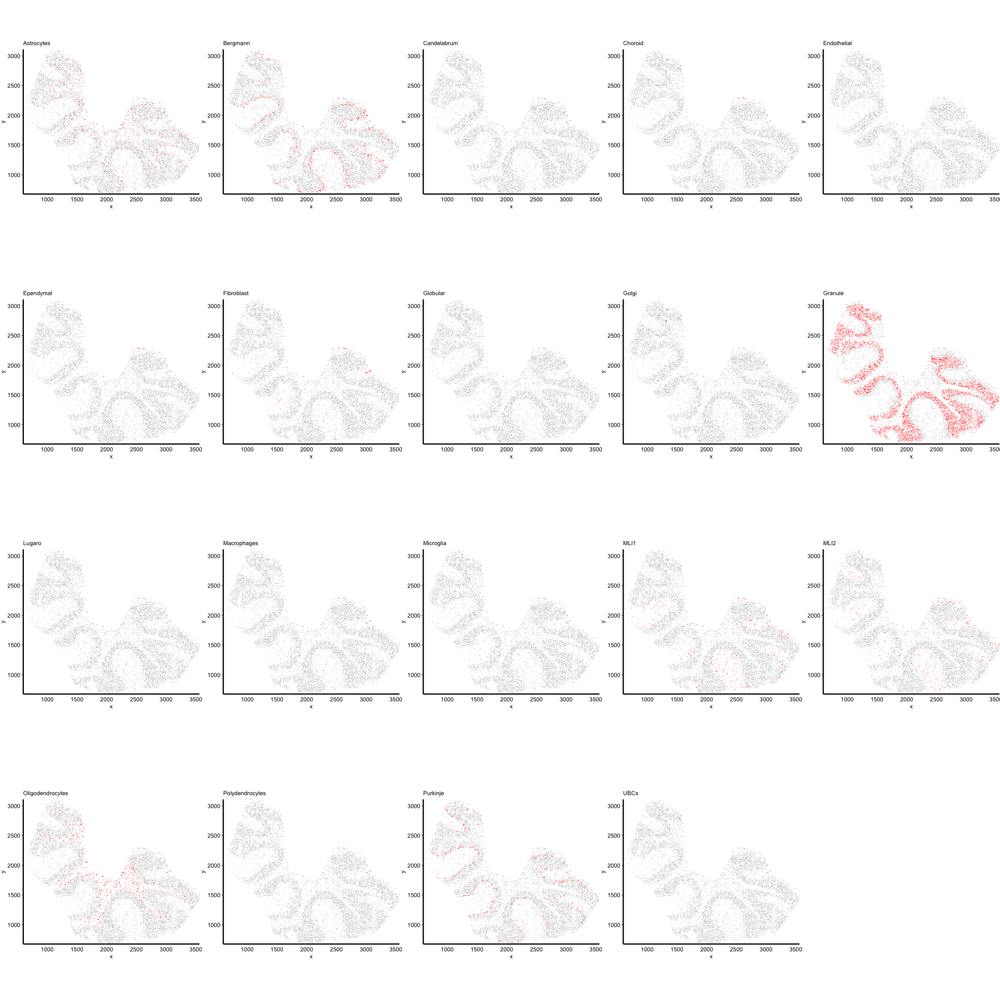
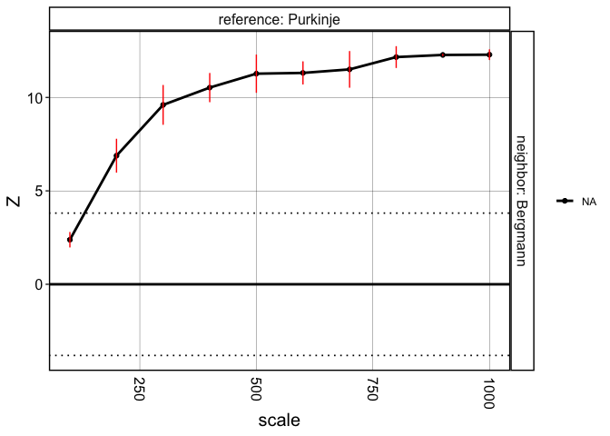
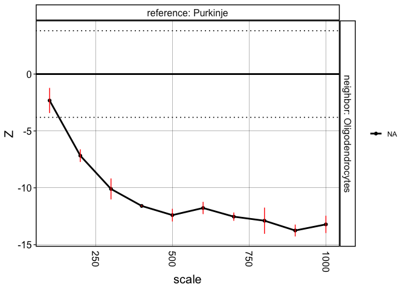

This vignette will go through analyses to reproduce the results and
figures of the Slide-seq dataset.

``` r
library(crawdad)
library(tidyverse)
```

    ## ── Attaching core tidyverse packages ──────────────────────── tidyverse 2.0.0 ──
    ## ✔ dplyr     1.1.2     ✔ readr     2.1.4
    ## ✔ forcats   1.0.0     ✔ stringr   1.5.0
    ## ✔ ggplot2   3.4.2     ✔ tibble    3.2.1
    ## ✔ lubridate 1.9.2     ✔ tidyr     1.3.0
    ## ✔ purrr     1.0.1     
    ## ── Conflicts ────────────────────────────────────────── tidyverse_conflicts() ──
    ## ✖ dplyr::filter() masks stats::filter()
    ## ✖ dplyr::lag()    masks stats::lag()
    ## ℹ Use the conflicted package (<http://conflicted.r-lib.org/>) to force all conflicts to become errors

``` r
ncores = 7
```

# Load data

``` r
data(slide)

## convert to sp::SpatialPointsDataFrame
slide <- crawdad:::toSP(pos = slide[,c("x", "y")],
                        celltypes = slide$celltypes)
```

    ## Warning: 'celltypes' does not have levels. Creating levels from values

    ## creating `sp::SpatialPointsDataFrame`

# Visualize celltypes

``` r
crawdad::vizEachCluster(cells = slide,
                        coms = as.factor(slide$celltypes),
                        s = 2)
```



    ## TableGrob (4 x 5) "arrange": 19 grobs
    ##     z     cells    name           grob
    ## 1   1 (1-1,1-1) arrange gtable[layout]
    ## 2   2 (1-1,2-2) arrange gtable[layout]
    ## 3   3 (1-1,3-3) arrange gtable[layout]
    ## 4   4 (1-1,4-4) arrange gtable[layout]
    ## 5   5 (1-1,5-5) arrange gtable[layout]
    ## 6   6 (2-2,1-1) arrange gtable[layout]
    ## 7   7 (2-2,2-2) arrange gtable[layout]
    ## 8   8 (2-2,3-3) arrange gtable[layout]
    ## 9   9 (2-2,4-4) arrange gtable[layout]
    ## 10 10 (2-2,5-5) arrange gtable[layout]
    ## 11 11 (3-3,1-1) arrange gtable[layout]
    ## 12 12 (3-3,2-2) arrange gtable[layout]
    ## 13 13 (3-3,3-3) arrange gtable[layout]
    ## 14 14 (3-3,4-4) arrange gtable[layout]
    ## 15 15 (3-3,5-5) arrange gtable[layout]
    ## 16 16 (4-4,1-1) arrange gtable[layout]
    ## 17 17 (4-4,2-2) arrange gtable[layout]
    ## 18 18 (4-4,3-3) arrange gtable[layout]
    ## 19 19 (4-4,4-4) arrange gtable[layout]

# Make shuffled background

``` r
scales <- seq(100, 1000, by=100)
```

``` r
## generate background
shuffle.list <- crawdad:::makeShuffledCells(slide,
                          scales = scales,
                          perms = 3,
                          ncores = ncores,
                          seed = 1,
                          verbose = FALSE)
```

# Run pairwise analysis

``` r
## find trends, passing background as parameter
results <- crawdad::findTrends(slide,
                        dist = 100,
                        shuffle.list = shuffle.list,
                        ncores = ncores,
                        verbose = FALSE,
                        returnMeans = FALSE)
```

``` r
## convert results to data.frame
dat <- crawdad::meltResultsList(results, withPerms = T)
```

# Visualize results

``` r
## multiple-test correction
ntests <- length(unique(dat$reference)) * length(unique(dat$reference))
psig <- 0.05/ntests
zsig <- round(qnorm(psig/2, lower.tail = F), 2)
```

Summary visualization of CRAWDAD’s multi-scale cell-type spatial
relationship analysis.

``` r
vizColocDotplot(dat, reorder = TRUE, zsig.thresh = zsig, zscore.limit = zsig*2) +
  theme(legend.position='right',
        axis.text.x = element_text(angle = 45, h = 0))
```

    ## Scale for x is already present.
    ## Adding another scale for x, which will replace the existing scale.


Visualize specific trends.

``` r
dat_filter <- dat %>% 
  filter(reference == 'Purkinje') %>% 
  filter(neighbor == 'Bergmann')
vizTrends(dat_filter, lines = T, withPerms = T, sig.thresh = zsig)
```



``` r
dat_filter <- dat %>% 
  filter(reference == 'Purkinje') %>% 
  filter(neighbor == 'Oligodendrocytes')
vizTrends(dat_filter, lines = T, withPerms = T, sig.thresh = zsig)
```


