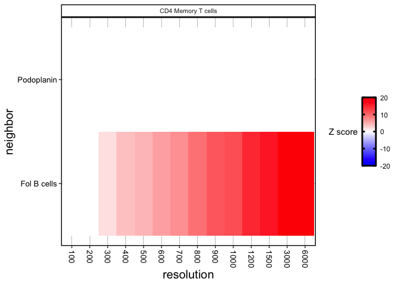
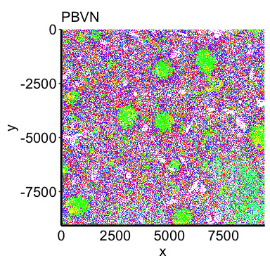
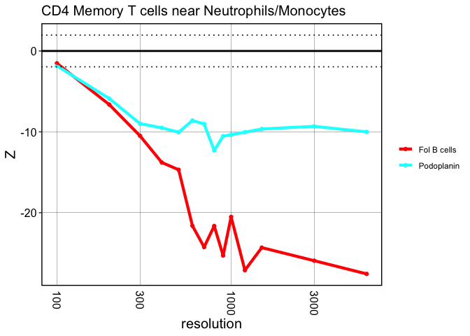

This vignette will go through analyses to reproduce the results and
figures of the CODEX spleen datasets.

``` r
library(crawdad)
library(dplyr)
```

``` r
ncores = 2
```

# PKHL

## Load data

``` r
pkhl <- read.csv2(file = paste0(here::here(), "/data/spleen/PKHL.meta.csv.gz"), row.names = 1)
pkhl <- pkhl[,c("x", "y", "celltypes_folBcombined")]
## make sure the coordinates are numeric
pkhl <- pkhl %>%
  dplyr::mutate_at(vars(x, y), as.numeric)

## convert to SP
pkhl <- crawdad::toSP(pos = pkhl[,c("x", "y")],
                        celltypes = pkhl$celltypes_folBcombined)
pkhl
```

``` r
## the above dataset has been saved as an rda file and able to load here:
data(pkhl)

## convert to SP
pkhl <- crawdad::toSP(pos = pkhl[,c("x", "y")],
                        celltypes = pkhl$celltypes)
```

    ## Warning: 'celltypes' does not have levels. Creating levels from values

    ## creating `sp::SpatialPointsDataFrame`

``` r
pkhl
```

    ## Simple feature collection with 154446 features and 1 field
    ## Attribute-geometry relationship: 1 constant, 0 aggregate, 0 identity
    ## Geometry type: POINT
    ## Dimension:     XY
    ## Bounding box:  xmin: 0 ymin: -9071 xmax: 9407 ymax: 0
    ## CRS:           NA
    ## First 10 features:
    ##                celltypes        geometry
    ## 1       Sinusoidal cells   POINT (0 -32)
    ## 2          Myeloid cells   POINT (0 -78)
    ## 3          Myeloid cells   POINT (13 -4)
    ## 4       Sinusoidal cells   POINT (7 -58)
    ## 5  Neutrophils/Monocytes  POINT (0 -129)
    ## 6  Neutrophils/Monocytes  POINT (7 -104)
    ## 7      Blood endothelial  POINT (8 -167)
    ## 8       Sinusoidal cells  POINT (0 -281)
    ## 9      Blood endothelial POINT (14 -197)
    ## 10     Blood endothelial POINT (18 -136)

## Visualize celltypes

``` r
crawdad::vizEachCluster(cells = pkhl,
                        coms = as.factor(pkhl$celltypes),
                        s = 2)
```


    ## TableGrob (4 x 3) "arrange": 12 grobs
    ##     z     cells    name           grob
    ## 1   1 (1-1,1-1) arrange gtable[layout]
    ## 2   2 (1-1,2-2) arrange gtable[layout]
    ## 3   3 (1-1,3-3) arrange gtable[layout]
    ## 4   4 (2-2,1-1) arrange gtable[layout]
    ## 5   5 (2-2,2-2) arrange gtable[layout]
    ## 6   6 (2-2,3-3) arrange gtable[layout]
    ## 7   7 (3-3,1-1) arrange gtable[layout]
    ## 8   8 (3-3,2-2) arrange gtable[layout]
    ## 9   9 (3-3,3-3) arrange gtable[layout]
    ## 10 10 (4-4,1-1) arrange gtable[layout]
    ## 11 11 (4-4,2-2) arrange gtable[layout]
    ## 12 12 (4-4,3-3) arrange gtable[layout]

## Make shuffled background

``` r
resolutions <- c(100, 200, 300, 400, 500, 600, 700, 800, 900, 1000, 1200, 1500, 3000, 6000)
```

``` r
## generate background
shuffle.list.pkhl <- crawdad:::makeShuffledCells(pkhl,
                          resolutions = resolutions,
                          perms = 1,
                          ncores = ncores,
                          seed = 1,
                          verbose = TRUE)

## note: 13.29 minutes with 7 cores, 2.3 GHz Quad-Core Intel Core i7
```

save shuffled object

``` r
saveRDS(shuffle.list.pkhl, paste0(here::here(), "/data/spleen/PKHL/pkhl.folBcombined.shuffled_res100-6000.rds"))
```

## Run pairwise analysis

``` r
## find trends, passing background as parameter
results.pkhl <- crawdad::findTrends(pkhl,
                        dist = 100,
                        shuffle.list = shuffle.list.pkhl,
                        ncores = ncores,
                        verbose = TRUE)

## note: 9.92 minutes with 7 cores, 2.3 GHz Quad-Core Intel Core i7
```

save pairwise results object

``` r
saveRDS(results.pkhl, paste0(here::here(), "/data/spleen/PKHL/pkhl.folBcombined.pairwise.results.dist100.res100-6000.rds"))

## object with distances 100-200: pkhl.pairwise.100-200.folBcombined.results.res100-6000.removeDups.rds
```

## Defining subsets

``` r
binomMat.pkhl <- crawdad::binomialTestMatrix(pkhl,
                               neigh.dist = 100,
                               ncores = ncores,
                               verbose = TRUE)

head(binomMat.pkhl)

## note: 143.72 minutes with 7 cores, 2.3 GHz Quad-Core Intel Core i7
## previous code iteration on rockfish took 15:09:48 hours with 32 cores! much better now 
```

save the binomial matrix

``` r
saveRDS(binomMat.pkhl, paste0(here::here(), "/data/spleen/PKHL/pkhl.folBcombined.binomMat.near.subdist100.rds"))
```

``` r
subset.list.pkhl <- crawdad::selectSubsets(binomMat.pkhl,
                             pkhl$celltypes,
                             sub.type = "near",
                             sub.thresh = 0.05,
                             ncores = ncores,
                             verbose = TRUE)
```

save the subsets

``` r
saveRDS(subset.list.pkhl, paste0(here::here(), "/data/spleen/PKHL/pkhl.folBcombined.subsets.near.subdist100.rds"))
```

## Run analysis on subsets

``` r
results.subsets.pkhl <- crawdad::findTrends(pkhl,
                        dist = 100,
                        shuffle.list = shuffle.list.pkhl,
                        subset.list = subset.list.pkhl,
                        ncores = ncores,
                        verbose = TRUE)

c
```

save the results

``` r
saveRDS(results.subsets.pkhl, paste0(here::here(), "/data/spleen/PKHL/pkhl.folBcombined.subset.results.dist100.res100-6000.rds"))

## pkhl.triplet.near.binom.subdist100.dist100.folBcombined.results.res100-6000.removeDups.rds
```

# KSFB

## Load data

``` r
ksfb <- read.csv2(file = paste0(here::here(), "/data/spleen/KSFB.meta.csv.gz"), row.names = 1)
ksfb <- ksfb[,c("x", "y", "celltypes_folBcombined")]
## make sure the coordinates are numeric
ksfb <- ksfb %>%
  dplyr::mutate_at(vars(x, y), as.numeric)

## convert to SP
ksfb <- crawdad::toSP(pos = ksfb[,c("x", "y")],
                        celltypes = ksfb$celltypes_folBcombined)
```

    ## Warning: 'celltypes' does not have levels. Creating levels from values

    ## creating `sp::SpatialPointsDataFrame`

``` r
ksfb
```

    ## Simple feature collection with 152896 features and 1 field
    ## Attribute-geometry relationship: 1 constant, 0 aggregate, 0 identity
    ## Geometry type: POINT
    ## Dimension:     XY
    ## Bounding box:  xmin: 0 ymin: -9071 xmax: 9407 ymax: 0
    ## CRS:           NA
    ## First 10 features:
    ##                celltypes       geometry
    ## 1       Sinusoidal cells  POINT (0 -55)
    ## 2     CD8 Memory T cells POINT (0 -111)
    ## 3     Ki67 proliferating POINT (0 -357)
    ## 4     CD4 Memory T cells POINT (0 -369)
    ## 5             indistinct POINT (0 -391)
    ## 6  Neutrophils/Monocytes POINT (0 -449)
    ## 7             indistinct POINT (0 -481)
    ## 8             indistinct POINT (0 -555)
    ## 9     CD4 Memory T cells POINT (2 -270)
    ## 10           Fol B cells POINT (0 -641)

## Visualize celltypes

``` r
crawdad::vizEachCluster(cells = ksfb,
                        coms = as.factor(ksfb$celltypes),
                        s = 2)
```


    ## TableGrob (4 x 3) "arrange": 12 grobs
    ##     z     cells    name           grob
    ## 1   1 (1-1,1-1) arrange gtable[layout]
    ## 2   2 (1-1,2-2) arrange gtable[layout]
    ## 3   3 (1-1,3-3) arrange gtable[layout]
    ## 4   4 (2-2,1-1) arrange gtable[layout]
    ## 5   5 (2-2,2-2) arrange gtable[layout]
    ## 6   6 (2-2,3-3) arrange gtable[layout]
    ## 7   7 (3-3,1-1) arrange gtable[layout]
    ## 8   8 (3-3,2-2) arrange gtable[layout]
    ## 9   9 (3-3,3-3) arrange gtable[layout]
    ## 10 10 (4-4,1-1) arrange gtable[layout]
    ## 11 11 (4-4,2-2) arrange gtable[layout]
    ## 12 12 (4-4,3-3) arrange gtable[layout]

## Make shuffled background

``` r
resolutions <- c(100, 200, 300, 400, 500, 600, 700, 800, 900, 1000, 1200, 1500, 3000, 6000)
```

``` r
## generate background
shuffle.list.ksfb <- crawdad:::makeShuffledCells(ksfb,
                          resolutions = resolutions,
                          perms = 1,
                          ncores = ncores,
                          seed = 1,
                          verbose = TRUE)

## note:  minutes with 7 cores, 2.3 GHz Quad-Core Intel Core i7
```

save shuffled object

``` r
saveRDS(shuffle.list.ksfb, paste0(here::here(), "/data/spleen/KSFB/ksfb.folBcombined.shuffled_res100-6000.rds"))
```

## Run pairwise analysis

``` r
## find trends, passing background as parameter
results.ksfb <- crawdad::findTrends(ksfb,
                        dist = 100,
                        shuffle.list = shuffle.list.ksfb,
                        ncores = ncores,
                        verbose = TRUE)

## note:  minutes with 7 cores, 2.3 GHz Quad-Core Intel Core i7
```

save pairwise results object

``` r
saveRDS(results.ksfb, paste0(here::here(), "/data/spleen/KSFB/ksfb.folBcombined.pairwise.results.dist100.res100-6000.rds"))

## object with distances 100-200: ksfb.pairwise.100-200.folBcombined.results.res100-6000.removeDups.rds
```

## Defining subsets

``` r
binomMat.ksfb <- crawdad::binomialTestMatrix(ksfb,
                               neigh.dist = 100,
                               ncores = ncores,
                               verbose = TRUE)

head(binomMat.ksfb)

## note:  minutes with 7 cores, 2.3 GHz Quad-Core Intel Core i7
```

save the binomial matrix

``` r
saveRDS(binomMat.ksfb, paste0(here::here(), "/data/spleen/KSFB/ksfb.folBcombined.binomMat.near.subdist100.rds"))
```

``` r
subset.list.ksfb <- crawdad::selectSubsets(binomMat.ksfb,
                             ksfb$celltypes,
                             sub.type = "near",
                             sub.thresh = 0.05,
                             ncores = ncores,
                             verbose = TRUE)
```

save the subsets

``` r
saveRDS(subset.list.ksfb, paste0(here::here(), "/data/spleen/KSFB/ksfb.folBcombined.subsets.near.subdist100.rds"))
```

## Run analysis on subsets

``` r
results.subsets.ksfb <- crawdad::findTrends(ksfb,
                        dist = 100,
                        shuffle.list = shuffle.list.ksfb,
                        subset.list = subset.list.ksfb,
                        ncores = ncores,
                        verbose = TRUE)

## note:  minutes with 7 cores, 2.3 GHz Quad-Core Intel Core i7; vs 12:23 minutes 14 cores on rockfish
```

save the results

``` r
saveRDS(results.subsets.ksfb, paste0(here::here(), "/data/spleen/KSFB/ksfb.folBcombined.subset.results.dist100.res100-6000.rds"))

## ksfb.triplet.near.binom.subdist100.dist100.folBcombined.results.res100-6000.removeDups.rds
```

# XXCD

## Load data

``` r
xxcd <- read.csv2(file = paste0(here::here(), "/data/spleen/XXCD.meta.csv.gz"), row.names = 1)
xxcd <- xxcd[,c("x", "y", "celltypes_folBcombined")]
## make sure the coordinates are numeric
xxcd <- xxcd %>%
  dplyr::mutate_at(vars(x, y), as.numeric)

## convert to SP
xxcd <- crawdad::toSP(pos = xxcd[,c("x", "y")],
                        celltypes = xxcd$celltypes_folBcombined)
```

    ## Warning: 'celltypes' does not have levels. Creating levels from values

    ## creating `sp::SpatialPointsDataFrame`

``` r
xxcd
```

    ## Simple feature collection with 150311 features and 1 field
    ## Attribute-geometry relationship: 1 constant, 0 aggregate, 0 identity
    ## Geometry type: POINT
    ## Dimension:     XY
    ## Bounding box:  xmin: 0 ymin: -9071 xmax: 9407 ymax: 0
    ## CRS:           NA
    ## First 10 features:
    ##                celltypes        geometry
    ## 1     CD8 Memory T cells   POINT (0 -25)
    ## 2            Fol B cells    POINT (13 0)
    ## 3            Fol B cells   POINT (4 -63)
    ## 4            Fol B cells  POINT (0 -128)
    ## 5            Fol B cells  POINT (0 -150)
    ## 6  Neutrophils/Monocytes  POINT (0 -300)
    ## 7      Blood endothelial  POINT (0 -329)
    ## 8  Neutrophils/Monocytes  POINT (0 -420)
    ## 9     CD8 Memory T cells  POINT (0 -544)
    ## 10    CD4 Memory T cells POINT (14 -105)

# PBVN

## Load data

``` r
pbvn <- read.csv2(file = paste0(here::here(), "/data/spleen/PBVN.meta.csv.gz"), row.names = 1)
pbvn <- pbvn[,c("x", "y", "celltypes_folBcombined")]
## make sure the coordinates are numeric
pbvn <- pbvn %>%
  dplyr::mutate_at(vars(x, y), as.numeric)

## convert to SP
pbvn <- crawdad::toSP(pos = pbvn[,c("x", "y")],
                        celltypes = pbvn$celltypes_folBcombined)
```

    ## Warning: 'celltypes' does not have levels. Creating levels from values

    ## creating `sp::SpatialPointsDataFrame`

``` r
pbvn
```

    ## Simple feature collection with 130584 features and 1 field
    ## Attribute-geometry relationship: 1 constant, 0 aggregate, 0 identity
    ## Geometry type: POINT
    ## Dimension:     XY
    ## Bounding box:  xmin: 0 ymin: -9071 xmax: 9407 ymax: 0
    ## CRS:           NA
    ## First 10 features:
    ##             celltypes        geometry
    ## 1  Ki67 proliferating  POINT (0 -148)
    ## 2  Ki67 proliferating  POINT (0 -403)
    ## 3  CD8 Memory T cells  POINT (0 -434)
    ## 4    Sinusoidal cells  POINT (0 -488)
    ## 5    Sinusoidal cells  POINT (0 -602)
    ## 6    Sinusoidal cells  POINT (0 -697)
    ## 7   Blood endothelial POINT (20 -728)
    ## 8    Sinusoidal cells  POINT (0 -771)
    ## 9  CD8 Memory T cells  POINT (0 -882)
    ## 10   Sinusoidal cells  POINT (0 -902)

# FSLD

## Load data

``` r
fsld <- read.csv2(file = paste0(here::here(), "/data/spleen/FSLD.meta.csv.gz"), row.names = 1)
fsld <- fsld[,c("x", "y", "celltypes_folBcombined")]
## make sure the coordinates are numeric
fsld <- fsld %>%
  dplyr::mutate_at(vars(x, y), as.numeric)

## convert to SP
fsld <- crawdad::toSP(pos = fsld[,c("x", "y")],
                        celltypes = fsld$celltypes_folBcombined)
```

    ## Warning: 'celltypes' does not have levels. Creating levels from values

    ## creating `sp::SpatialPointsDataFrame`

``` r
fsld
```

    ## Simple feature collection with 226384 features and 1 field
    ## Attribute-geometry relationship: 1 constant, 0 aggregate, 0 identity
    ## Geometry type: POINT
    ## Dimension:     XY
    ## Bounding box:  xmin: 0 ymin: -9071 xmax: 12095 ymax: 0
    ## CRS:           NA
    ## First 10 features:
    ##           celltypes       geometry
    ## 1       Macrophages  POINT (0 -42)
    ## 2  Sinusoidal cells POINT (0 -167)
    ## 3  Sinusoidal cells POINT (0 -281)
    ## 4        indistinct POINT (0 -306)
    ## 5        indistinct POINT (0 -368)
    ## 6        indistinct POINT (0 -483)
    ## 7        indistinct POINT (0 -551)
    ## 8  Sinusoidal cells POINT (0 -651)
    ## 9       Macrophages POINT (0 -743)
    ## 10 Sinusoidal cells POINT (0 -808)

# NGPL

## Load data

``` r
ngpl <- read.csv2(file = paste0(here::here(), "/data/spleen/NGPL.meta.csv.gz"), row.names = 1)
ngpl <- ngpl[,c("x", "y", "celltypes_folBcombined")]
## make sure the coordinates are numeric
ngpl <- ngpl %>%
  dplyr::mutate_at(vars(x, y), as.numeric)

## convert to SP
ngpl <- crawdad::toSP(pos = ngpl[,c("x", "y")],
                        celltypes = ngpl$celltypes_folBcombined)
```

    ## Warning: 'celltypes' does not have levels. Creating levels from values

    ## creating `sp::SpatialPointsDataFrame`

``` r
ngpl
```

    ## Simple feature collection with 177777 features and 1 field
    ## Attribute-geometry relationship: 1 constant, 0 aggregate, 0 identity
    ## Geometry type: POINT
    ## Dimension:     XY
    ## Bounding box:  xmin: 0 ymin: -9071 xmax: 9407 ymax: 0
    ## CRS:           NA
    ## First 10 features:
    ##                celltypes        geometry
    ## 1      B cells, red pulp  POINT (2 -375)
    ## 2       Sinusoidal cells  POINT (21 -84)
    ## 3      Blood endothelial POINT (20 -545)
    ## 4       Sinusoidal cells POINT (20 -657)
    ## 5       Sinusoidal cells POINT (20 -844)
    ## 6  Neutrophils/Monocytes POINT (22 -471)
    ## 7     Ki67 proliferating POINT (20 -956)
    ## 8       Sinusoidal cells  POINT (6 -310)
    ## 9  Neutrophils/Monocytes POINT (23 -115)
    ## 10            indistinct     POINT (0 0)

# ———————————

# Figures

## A. load data

### PKHL

primary spleen dataset (PKHL):

``` r
## folder on `brendan` branch
figpath <- paste0(here::here(), "/plots/spleen")

shuffle.list.pkhl <- readRDS(paste0(here::here(), "/data/spleen/PKHL/pkhl.folBcombined.shuffled_res100-6000.rds"))

binomMat.pkhl <- readRDS(paste0(here::here(), "/data/spleen/PKHL/pkhl.folBcombined.binomMat.near.subdist100.rds"))
subset.list.pkhl <- readRDS(paste0(here::here(), "/data/spleen/PKHL/pkhl.folBcombined.subsets.near.subdist100.rds"))

results.pkhl <- readRDS(paste0(here::here(), "/data/spleen/PKHL/pkhl.folBcombined.pairwise.results.dist100.res100-6000.rds")) ## newest
# results.pkhl <- readRDS(paste0(here::here(), "/data/spleen/PKHL/pkhl.pairwise.100-200.folBcombined.results.res100-6000.removeDups.rds")) ## old file, but should be equal

results.subsets.pkhl <- readRDS(paste0(here::here(), "/data/spleen/PKHL/pkhl.folBcombined.subset.results.dist100.res100-6000.rds")) ## newest
# results.subsets.pkhl <- readRDS(paste0(here::here(), "/data/spleen/PKHL/pkhl.triplet.near.binom.subdist100.dist100.folBcombined.results.res100-6000.removeDups.rds")) ## old file but, but should be equal
```

other spleen datasets:

### KSFB

``` r
shuffle.list.ksfb <- readRDS(paste0(here::here(), "/data/spleen/KSFB/ksfb.folBcombined.shuffled_res100-6000.rds"))

# binomMat.ksfb <- readRDS(paste0(here::here(), "/data/spleen/KSFB/ksfb.folBcombined.binomMat.near.subdist100.rds"))
subset.list.ksfb <- readRDS(paste0(here::here(), "/data/spleen/KSFB/ksfb.folBcombined.subsets.near.subdist100.rds"))

# results.ksfb <- readRDS(paste0(here::here(), "/data/spleen/KSFB/ksfb.folBcombined.pairwise.results.dist100.res100-6000.rds")) ## newest
results.ksfb <- readRDS(paste0(here::here(), "/data/spleen/KSFB/ksfb.pairwise.100-200.folBcombined.results.res100-6000.removeDups.rds")) ## old file, but should be equal

# results.subsets.ksfb <- readRDS(paste0(here::here(), "/data/spleen/KSFB/ksfb.folBcombined.subset.results.dist100.res100-6000.rds")) ## newest
results.subsets.ksfb <- readRDS(paste0(here::here(), "/data/spleen/KSFB/ksfb.triplet.near.binom.subdist100.dist100.folBcombined.results.res100-6000.removeDups.rds")) ## old file, but should be equal
```

### XXCD

``` r
shuffle.list.xxcd <- readRDS(paste0(here::here(), "/data/spleen/XXCD/xxcd.folBcombined.shuffled_res100-6000.rds"))

# binomMat.xxcd <- readRDS(paste0(here::here(), "/data/spleen/XXCD/xxcd.folBcombined.binomMat.near.subdist100.rds"))
subset.list.xxcd <- readRDS(paste0(here::here(), "/data/spleen/XXCD/xxcd.folBcombined.subsets.near.subdist100.rds"))

# results.xxcd <- readRDS(paste0(here::here(), "/data/spleen/XXCD/xxcd.folBcombined.pairwise.results.dist100.res100-6000.rds")) ## newest
results.xxcd <- readRDS(paste0(here::here(), "/data/spleen/XXCD/xxcd.pairwise.100-200.folBcombined.results.res100-6000.removeDups.rds")) ## old file, but should be equal

# results.subsets.xxcd <- readRDS(paste0(here::here(), "/data/spleen/XXCD/xxcd.folBcombined.subset.results.dist100.res100-6000.rds")) ## newest
results.subsets.xxcd <- readRDS(paste0(here::here(), "/data/spleen/XXCD/xxcd.triplet.near.binom.subdist100.dist100.folBcombined.results.res100-6000.removeDups.rds")) ## old file, but should be equal
```

### PBVN

``` r
shuffle.list.pbvn <- readRDS(paste0(here::here(), "/data/spleen/PBVN/pbvn.folBcombined.shuffled_res100-6000.rds"))

# binomMat.pbvn <- readRDS(paste0(here::here(), "/data/spleen/PBVN/pbvn.folBcombined.binomMat.near.subdist100.rds"))
subset.list.pbvn <- readRDS(paste0(here::here(), "/data/spleen/PBVN/pbvn.folBcombined.subsets.near.subdist100.rds"))

# results.pbvn <- readRDS(paste0(here::here(), "/data/spleen/PBVN/pbvn.folBcombined.pairwise.results.dist100.res100-6000.rds")) ## newest
results.pbvn <- readRDS(paste0(here::here(), "/data/spleen/PBVN/pbvn.pairwise.100-200.folBcombined.results.res100-6000.removeDups.rds")) ## old file, but should be equal

# results.subsets.pbvn <- readRDS(paste0(here::here(), "/data/spleen/PBVN/pbvn.folBcombined.subset.results.dist100.res100-6000.rds")) ## newest
results.subsets.pbvn <- readRDS(paste0(here::here(), "/data/spleen/PBVN/pbvn.triplet.near.binom.subdist100.dist100.folBcombined.results.res100-6000.removeDups.rds")) ## old file, but should be equal
```

### FSLD

``` r
shuffle.list.fsld <- readRDS(paste0(here::here(), "/data/spleen/FSLD/fsld.folBcombined.shuffled_res100-6000.rds"))

# binomMat.fsld <- readRDS(paste0(here::here(), "/data/spleen/FSLD/fsld.folBcombined.binomMat.near.subdist100.rds"))
subset.list.fsld <- readRDS(paste0(here::here(), "/data/spleen/FSLD/fsld.folBcombined.subsets.near.subdist100.rds"))

# results.fsld <- readRDS(paste0(here::here(), "/data/spleen/FSLD/fsld.folBcombined.pairwise.results.dist100.res100-6000.rds")) ## newest
results.fsld <- readRDS(paste0(here::here(), "/data/spleen/FSLD/fsld.pairwise.100-200.folBcombined.results.res100-6000.removeDups.rds")) ## old file, but should be equal

# results.subsets.fsld <- readRDS(paste0(here::here(), "/data/spleen/FSLD/fsld.folBcombined.subset.results.dist100.res100-6000.rds")) ## newest
results.subsets.fsld <- readRDS(paste0(here::here(), "/data/spleen/FSLD/fsld.triplet.near.binom.subdist100.dist100.folBcombined.results.res100-6000.removeDups.rds")) ## old file, but should be equal
```

### NGPL

``` r
shuffle.list.ngpl <- readRDS(paste0(here::here(), "/data/spleen/NGPL/ngpl.folBcombined.shuffled_res100-6000.rds"))

# binomMat.ngpl <- readRDS(paste0(here::here(), "/data/spleen/NGPL/ngpl.folBcombined.binomMat.near.subdist100.rds"))
subset.list.ngpl <- readRDS(paste0(here::here(), "/data/spleen/NGPL/ngpl.folBcombined.subsets.near.subdist100.rds"))

# results.ngpl <- readRDS(paste0(here::here(), "/data/spleen/NGPL/ngpl.folBcombined.pairwise.results.dist100.res100-6000.rds")) ## newest
results.ngpl <- readRDS(paste0(here::here(), "/data/spleen/NGPL/ngpl.pairwise.100-200.folBcombined.results.res100-6000.removeDups.rds")) ## old file, but should be equal

# results.subsets.ngpl <- readRDS(paste0(here::here(), "/data/spleen/NGPL/ngpl.folBcombined.subset.results.dist100.res100-6000.rds")) ## newest
results.subsets.ngpl <- readRDS(paste0(here::here(), "/data/spleen/NGPL/ngpl.triplet.near.binom.subdist100.dist100.folBcombined.results.res100-6000.removeDups.rds")) ## old file, but should be equal
```

## B. plotting

### Fig 3 - PKHL

#### tissue

``` r
plt <- crawdad::vizAllClusters(cells = pkhl,
                        coms = as.factor(pkhl$celltypes),
                        ofInterest = c("CD4 Memory T cells", "Fol B cells", "Podoplanin"),
                        nacol = crawdad:::transparentCol(color = "white", percent = 100),
                        axisAdj = 1, s = 1, a = 0.5) +
  ggplot2::theme(legend.position="none")
  # ggplot2::guides(colour = ggplot2::guide_legend(override.aes = list(size=2), ncol = 1))
plt
```


``` r
# ggplot2::ggsave(filename = "3_spleen_pkhl_tissue.pdf",
#                 plot = plt,
#                 device = "pdf",
#                 path = figpath,
#                 scale = 1,
#                 width = 6,
#                 height = 6,
#                 units = c("in"))
```

#### subsets tissue

``` r
## make a temporary annotation factor with annotations for cells that are of a specific subsets
annots_temp <- crawdad::selectLabels(df = pkhl,
                                     com = pkhl$celltypes,
                                     subset_list = subset.list.pkhl,
                                     cellIDs = c("Fol B cells", "Podoplanin"),
                                     subsetIDs = c("CD4 Memory T cells_near_Neutrophils/Monocytes"))

## visualize the subset only
plt <- crawdad::vizAllClusters(cells = pkhl,
                               coms = annots_temp,
                               ofInterest = NULL,
                               title = "PKHL",
                               nacol = crawdad:::transparentCol(color = "white", percent = 100),
                               axisAdj = 1, s = 1, a = 0.5) +
  # ggplot2::guides(colour = ggplot2::guide_legend(override.aes = list(size=2), ncol = 1))
  ggplot2::theme(legend.position="none")
plt
```


``` r
# ggplot2::ggsave(filename = "3_spleen_pkhl_cd4_subsets_outsideFol_tissue.pdf",
#                 plot = plt,
#                 device = "pdf",
#                 path = figpath,
#                 scale = 1,
#                 width = 10,
#                 height = 7,
#                 units = c("in"))
```

``` r
## make a temporary annotation factor with annotations for cells that are of a specific subsets
annots_temp <- crawdad::selectLabels(df = pkhl,
                                     com = pkhl$celltypes,
                                     subset_list = subset.list.pkhl,
                                     cellIDs = c("Fol B cells", "Podoplanin"),
                                     subsetIDs = c("CD4 Memory T cells_near_Fol B cells"))

## visualize the subset only
plt <- crawdad::vizAllClusters(cells = pkhl,
                               coms = annots_temp,
                               ofInterest = NULL,
                               title = "PKHL",
                               nacol = crawdad:::transparentCol(color = "white", percent = 100),
                               axisAdj = 1, s = 1, a = 0.5) +
  # ggplot2::guides(colour = ggplot2::guide_legend(override.aes = list(size=2), ncol = 1))
  ggplot2::theme(legend.position="none")
plt
```


``` r
# ggplot2::ggsave(filename = "3_spleen_pkhl_cd4_subsets_insideFol_tissue.pdf",
#                 plot = plt,
#                 device = "pdf",
#                 path = figpath,
#                 scale = 1,
#                 width = 10,
#                 height = 7,
#                 units = c("in"))
```

#### tissue zoom

``` r
## shuffling grid
grid <- sf::st_make_grid(pkhl, cellsize = 1000)

## centers of the grids to add the tile IDs
grid_coords_centroids <- as.data.frame(sf::st_coordinates(sf::st_centroid(grid)))
grid_coords_centroids$name <- as.character(rownames(grid_coords_centroids))


plt <- crawdad::vizAllClusters(cells = pkhl,
                               coms = pkhl$celltypes,
                               ofInterest = c("CD4 Memory T cells", "Fol B cells", "Podoplanin"),
                               title = "pkhl",
                               axisAdj = 1, s = 1, a = 0.5) +
  # ggplot2::guides(colour = ggplot2::guide_legend(override.aes = list(size=2), ncol = 1)) +
  ggplot2::theme(legend.position="none") +
  
  ## add in the grid information on top of the plot
  ggplot2::geom_sf(data = grid, fill = NA) +
  ggplot2::geom_text(data = grid_coords_centroids, ggplot2::aes(X, Y, label = name))
```

    ## Coordinate system already present. Adding new coordinate system, which will replace
    ## the existing one.

``` r
plt
```


``` r
# ggplot2::ggsave(filename = "3_spleen_pkhl_grid_tissue.pdf",
#                 plot = plt,
#                 device = "pdf",
#                 path = figpath,
#                 scale = 1,
#                 width = 10,
#                 height = 7,
#                 units = c("in"))
```

``` r
## pull out cells in specific grid regions
int <- sf::st_intersection(pkhl, grid[c(38,39)])
cells2 <- pkhl[rownames(int),]

## grid 11 real
plt <- crawdad::vizAllClusters(cells = cells2,
                               coms = cells2$celltypes,
                               ofInterest = c("CD4 Memory T cells", "Fol B cells", "Podoplanin"),
                               title = "grid 38,39",
                               axisAdj = 1, s = 10, a = 0.5) +
  # ggplot2::guides(colour = ggplot2::guide_legend(override.aes = list(size=2), ncol = 1)) +
  ggplot2::theme(legend.position="none")
plt
```


``` r
# ggplot2::ggsave(filename = "3_spleen_pkhl_grid_38_39_tissue_zoom.pdf",
#                 plot = plt,
#                 device = "pdf",
#                 path = figpath,
#                 scale = 1,
#                 width = 4,
#                 height = 3,
#                 units = c("in"))
```

``` r
## pull out cells in specific grid regions
int <- sf::st_intersection(pkhl, grid[c(67,77)])
cells2 <- pkhl[rownames(int),]

## grid 11 real
plt <- crawdad::vizAllClusters(cells = cells2,
                               coms = cells2$celltypes,
                               ofInterest = c("CD4 Memory T cells", "Fol B cells", "Podoplanin"),
                               title = "grid 66,77",
                               axisAdj = 1, s = 10, a = 0.5) +
  # ggplot2::guides(colour = ggplot2::guide_legend(override.aes = list(size=2), ncol = 1)) +
  ggplot2::theme(legend.position="none")
plt
```


``` r
# ggplot2::ggsave(filename = "3_spleen_pkhl_grid_66_77_tissue_zoom.pdf",
#                 plot = plt,
#                 device = "pdf",
#                 path = figpath,
#                 scale = 1,
#                 width = 3,
#                 height = 4,
#                 units = c("in"))
```

#### cd4,folB,podo trends

``` r
dat <- crawdad::meltResultsList(results.pkhl)

d1 <- dat[dat$reference == "CD4 Memory T cells" & dat$neighbor == "Fol B cells",]
d2 <- dat[dat$reference == "CD4 Memory T cells" & dat$neighbor == "Podoplanin",]
d3 <- dat[dat$reference == "Fol B cells" & dat$neighbor == "CD4 Memory T cells",]

## combine the trends into one data.frame, and have the "id" column label the combo, plot both lines on same plot
## turn off the facet wrap so just coloring the two trends, which are labeled using the "id" column

d1$id <- "Fol B cells"
d2$id <- "Podoplanin"
d3$id <- "Fol B cells vs CD4 Memory T cells"

d <- dplyr::bind_rows(list(d1, d2))

plt <- crawdad::vizTrends(dat = d, facet = FALSE) +
  ggplot2::scale_x_log10() +
  ggplot2::ggtitle("CD4 Memory T cells")
  # ggplot2::theme(legend.position="none")
plt 
```


``` r
# ggplot2::ggsave(filename = "3_spleen_pkhl_cd4_trends.pdf",
#                 plot = plt,
#                 device = "pdf",
#                 path = figpath,
#                 scale = 1,
#                 width = 6,
#                 height = 4,
#                 units = c("in"))

plt <- vizTrends.heatmap(dat = d, annotation = FALSE)
plt
```



``` r
# ggplot2::ggsave(filename = "S6_spleen_pkhl_cd4_trends_heatmap.pdf",
#                 plot = plt,
#                 device = "pdf",
#                 path = figpath,
#                 scale = 1,
#                 width = 6,
#                 height = 3,
#                 units = c("in"))
```

``` r
dat <- crawdad::meltResultsList(results.pkhl)
plt <- vizTrends.heatmap(dat = dat, annotation = FALSE, title = "PKHL")
plt
```


``` r
# ggplot2::ggsave(filename = "3B_spleen_pkhl_all_trends_heatmap.pdf",
#                 plot = plt,
#                 device = "pdf",
#                 path = figpath,
#                 scale = 1,
#                 width = 12,
#                 height = 10,
#                 units = c("in"))
```

#### subset trends

``` r
dat <- crawdad::meltResultsList(results.subsets.pkhl)

d1 <- dat[grepl(pattern = "CD4 Memory T cells_near_Fol B cells", dat$reference) & dat$neighbor %in% c("Fol B cells", "Podoplanin"),]
plt <- vizTrends(dat = d1, facet = FALSE, id = "neighbor", title = "CD4 Memory T cells near Fol B cells") +
  ggplot2::scale_x_log10()
  # ggplot2::theme(legend.position="none")
plt
```


``` r
# ggplot2::ggsave(filename = "3_spleen_pkhl_cd4_near_folB_trends.pdf",
#                 plot = plt,
#                 device = "pdf",
#                 path = figpath,
#                 scale = 1,
#                 width = 6,
#                 height = 4,
#                 units = c("in"))


d2 <- dat[grepl(pattern = "CD4 Memory T cells_near_Neutrophils/Monocytes", dat$reference) & dat$neighbor %in% c("Fol B cells", "Podoplanin"),]
plt <- vizTrends(dat = d2, facet = FALSE, id = "neighbor", title = "CD4 Memory T cells near Neutrophils/Monocytes") +
  ggplot2::scale_x_log10()
  # ggplot2::theme(legend.position="none")
plt
```


``` r
# ggplot2::ggsave(filename = "3_spleen_pkhl_cd4_near_neutro_trends.pdf",
#                 plot = plt,
#                 device = "pdf",
#                 path = figpath,
#                 scale = 1,
#                 width = 6,
#                 height = 4,
#                 units = c("in"))

d <- dplyr::bind_rows(list(d1, d2))

plt <- vizTrends.heatmap(dat = d, annotation = FALSE)
plt
```


``` r
# ggplot2::ggsave(filename = "3_spleen_pkhl_cd4_subset_trends_heatmap.pdf",
#                 plot = plt,
#                 device = "pdf",
#                 path = figpath,
#                 scale = 1,
#                 width = 8,
#                 height = 3,
#                 units = c("in"))
```

### Other Spleens

#### Supplementary Figs

##### tissue

``` r
## KSFB
plt <- crawdad::vizAllClusters(cells = ksfb,
                        coms = as.factor(ksfb$celltypes),
                        # ofInterest = c("CD4 Memory T cells", "Fol B cells", "Podoplanin"),
                        title = "KSFB",
                        s = 1) +
  ggplot2::theme(legend.position="none")
  # ggplot2::guides(colour = ggplot2::guide_legend(override.aes = list(size=2), ncol = 1))
plt
```


``` r
# ggplot2::ggsave(filename = "S8_spleen_ksfb_tissue.pdf",
#                 plot = plt,
#                 device = "pdf",
#                 path = figpath,
#                 scale = 1,
#                 width = 6,
#                 height = 6,
#                 units = c("in"))

## XXCD
plt <- crawdad::vizAllClusters(cells = xxcd,
                        coms = as.factor(xxcd$celltypes),
                        # ofInterest = c("CD4 Memory T cells", "Fol B cells", "Podoplanin"),
                        title = "XXCD",
                        s = 1) +
  ggplot2::theme(legend.position="none")
  # ggplot2::guides(colour = ggplot2::guide_legend(override.aes = list(size=2), ncol = 1))
plt
```


``` r
# ggplot2::ggsave(filename = "S8_spleen_xxcd_tissue.pdf",
#                 plot = plt,
#                 device = "pdf",
#                 path = figpath,
#                 scale = 1,
#                 width = 6,
#                 height = 6,
#                 units = c("in"))

## PBVN
plt <- crawdad::vizAllClusters(cells = pbvn,
                        coms = as.factor(pbvn$celltypes),
                        # ofInterest = c("CD4 Memory T cells", "Fol B cells", "Podoplanin"),
                        title = "PBVN",
                        s = 1) +
  ggplot2::theme(legend.position="none")
  # ggplot2::guides(colour = ggplot2::guide_legend(override.aes = list(size=2), ncol = 1))
plt
```



``` r
# ggplot2::ggsave(filename = "S8_spleen_pbvn_tissue.pdf",
#                 plot = plt,
#                 device = "pdf",
#                 path = figpath,
#                 scale = 1,
#                 width = 6,
#                 height = 6,
#                 units = c("in"))

## FSLD
plt <- crawdad::vizAllClusters(cells = fsld,
                        coms = as.factor(fsld$celltypes),
                        # ofInterest = c("CD4 Memory T cells", "Fol B cells", "Podoplanin"),
                        title = "FSLD",
                        s = 1) +
  ggplot2::theme(legend.position="none")
  # ggplot2::guides(colour = ggplot2::guide_legend(override.aes = list(size=2), ncol = 1))
plt
```


``` r
# ggplot2::ggsave(filename = "S8_spleen_fsld_tissue.pdf",
#                 plot = plt,
#                 device = "pdf",
#                 path = figpath,
#                 scale = 1,
#                 width = 6,
#                 height = 6,
#                 units = c("in"))

## NGPL
plt <- crawdad::vizAllClusters(cells = ngpl,
                        coms = as.factor(ngpl$celltypes),
                        # ofInterest = c("CD4 Memory T cells", "Fol B cells", "Podoplanin"),
                        title = "NGPL",
                        s = 1) +
  ggplot2::theme(legend.position="none")
  # ggplot2::guides(colour = ggplot2::guide_legend(override.aes = list(size=2), ncol = 1))
plt
```


``` r
# ggplot2::ggsave(filename = "S8_spleen_ngpl_tissue.pdf",
#                 plot = plt,
#                 device = "pdf",
#                 path = figpath,
#                 scale = 1,
#                 width = 6,
#                 height = 6,
#                 units = c("in"))
```

##### cd4,folB,podo trends

``` r
dat <- crawdad::meltResultsList(results.xxcd$`100`)
d1 <- dat[dat$reference == "CD4 Memory T cells" & dat$neighbor == "Fol B cells",]
d2 <- dat[dat$reference == "CD4 Memory T cells" & dat$neighbor == "Podoplanin",]
df1 <- dplyr::bind_rows(list(d1, d2))
df1$reference <- "XXCD"

dat <- crawdad::meltResultsList(results.ksfb$`100`)
d1 <- dat[dat$reference == "CD4 Memory T cells" & dat$neighbor == "Fol B cells",]
d2 <- dat[dat$reference == "CD4 Memory T cells" & dat$neighbor == "Podoplanin",]
df2 <- dplyr::bind_rows(list(d1, d2))
df2$reference <- "KSFB"

dat <- crawdad::meltResultsList(results.ngpl$`100`)
d1 <- dat[dat$reference == "CD4 Memory T cells" & dat$neighbor == "Fol B cells",]
d2 <- dat[dat$reference == "CD4 Memory T cells" & dat$neighbor == "Podoplanin",]
df3 <- dplyr::bind_rows(list(d1, d2))
df3$reference <- "NGPL"

dat <- crawdad::meltResultsList(results.pbvn$`100`)
d1 <- dat[dat$reference == "CD4 Memory T cells" & dat$neighbor == "Fol B cells",]
d2 <- dat[dat$reference == "CD4 Memory T cells" & dat$neighbor == "Podoplanin",]
df4 <- dplyr::bind_rows(list(d1, d2))
df4$reference <- "PBVN"

dat <- crawdad::meltResultsList(results.fsld$`100`)
d1 <- dat[dat$reference == "CD4 Memory T cells" & dat$neighbor == "Fol B cells",]
d2 <- dat[dat$reference == "CD4 Memory T cells" & dat$neighbor == "Podoplanin",]
df5 <- dplyr::bind_rows(list(d1, d2))
df5$reference <- "FSLD"

df <- dplyr::bind_rows(list(df1, df2, df3, df4, df5))

plt <- vizTrends.heatmap(dat = df, annotation = FALSE, title = "CD4 Memory T cells", ncols = 5)
plt
```


``` r
# ggplot2::ggsave(filename = "S9_spleen_cd4_trends_heatmap.pdf",
#                 plot = plt,
#                 device = "pdf",
#                 path = figpath,
#                 scale = 1,
#                 width = 12,
#                 height = 3,
#                 units = c("in"))
```

``` r
dat <- crawdad::meltResultsList(results.ksfb$`100`)

d1 <- dat[dat$reference == "CD4 Memory T cells" & dat$neighbor == "Fol B cells",]
d2 <- dat[dat$reference == "CD4 Memory T cells" & dat$neighbor == "Podoplanin",]
d3 <- dat[dat$reference == "Fol B cells" & dat$neighbor == "CD4 Memory T cells",]

## combine the trends into one data.frame, and have the "id" column label the combo, plot both lines on same plot
## turn off the facet wrap so just coloring the two trends, which are labeled using the "id" column

d1$id <- "Fol B cells"
d2$id <- "Podoplanin"
d3$id <- "Fol B cells vs CD4 Memory T cells"

d <- dplyr::bind_rows(list(d1, d2))

plt <- crawdad::vizTrends(dat = d, facet = FALSE) +
  ggplot2::scale_x_log10()
  # ggplot2::theme(legend.position="none")
plt 
```


``` r
# ggplot2::ggsave(filename = "S9_spleen_ksfb_cd4_folB_podo_trends.pdf",
#                 plot = plt,
#                 device = "pdf",
#                 path = figpath,
#                 scale = 1,
#                 width = 6,
#                 height = 4,
#                 units = c("in"))
```

``` r
dat <- crawdad::meltResultsList(results.xxcd$`100`)

d1 <- dat[dat$reference == "CD4 Memory T cells" & dat$neighbor == "Fol B cells",]
d2 <- dat[dat$reference == "CD4 Memory T cells" & dat$neighbor == "Podoplanin",]
d3 <- dat[dat$reference == "Fol B cells" & dat$neighbor == "CD4 Memory T cells",]

## combine the trends into one data.frame, and have the "id" column label the combo, plot both lines on same plot
## turn off the facet wrap so just coloring the two trends, which are labeled using the "id" column

d1$id <- "Fol B cells"
d2$id <- "Podoplanin"
d3$id <- "Fol B cells vs CD4 Memory T cells"

d <- dplyr::bind_rows(list(d1, d2))

plt <- crawdad::vizTrends(dat = d, facet = FALSE) +
  ggplot2::scale_x_log10()
  # ggplot2::theme(legend.position="none")
plt 
```


``` r
# ggplot2::ggsave(filename = "S9_spleen_xxcd_cd4_folB_podo_trends.pdf",
#                 plot = plt,
#                 device = "pdf",
#                 path = figpath,
#                 scale = 1,
#                 width = 6,
#                 height = 4,
#                 units = c("in"))
```

``` r
dat <- crawdad::meltResultsList(results.pbvn$`100`)

d1 <- dat[dat$reference == "CD4 Memory T cells" & dat$neighbor == "Fol B cells",]
d2 <- dat[dat$reference == "CD4 Memory T cells" & dat$neighbor == "Podoplanin",]
d3 <- dat[dat$reference == "Fol B cells" & dat$neighbor == "CD4 Memory T cells",]

## combine the trends into one data.frame, and have the "id" column label the combo, plot both lines on same plot
## turn off the facet wrap so just coloring the two trends, which are labeled using the "id" column

d1$id <- "Fol B cells"
d2$id <- "Podoplanin"
d3$id <- "Fol B cells vs CD4 Memory T cells"

d <- dplyr::bind_rows(list(d1, d2))

plt <- crawdad::vizTrends(dat = d, facet = FALSE) +
  ggplot2::scale_x_log10()
  # ggplot2::theme(legend.position="none")
plt 
```


``` r
# ggplot2::ggsave(filename = "S9_spleen_pbvn_cd4_folB_podo_trends.pdf",
#                 plot = plt,
#                 device = "pdf",
#                 path = figpath,
#                 scale = 1,
#                 width = 6,
#                 height = 4,
#                 units = c("in"))
```

``` r
dat <- crawdad::meltResultsList(results.fsld$`100`)

d1 <- dat[dat$reference == "CD4 Memory T cells" & dat$neighbor == "Fol B cells",]
d2 <- dat[dat$reference == "CD4 Memory T cells" & dat$neighbor == "Podoplanin",]
d3 <- dat[dat$reference == "Fol B cells" & dat$neighbor == "CD4 Memory T cells",]

## combine the trends into one data.frame, and have the "id" column label the combo, plot both lines on same plot
## turn off the facet wrap so just coloring the two trends, which are labeled using the "id" column

d1$id <- "Fol B cells"
d2$id <- "Podoplanin"
d3$id <- "Fol B cells vs CD4 Memory T cells"

d <- dplyr::bind_rows(list(d1, d2))

plt <- crawdad::vizTrends(dat = d, facet = FALSE) +
  ggplot2::scale_x_log10()
  # ggplot2::theme(legend.position="none")
plt 
```


``` r
# ggplot2::ggsave(filename = "S9_spleen_fsld_cd4_folB_podo_trends.pdf",
#                 plot = plt,
#                 device = "pdf",
#                 path = figpath,
#                 scale = 1,
#                 width = 6,
#                 height = 4,
#                 units = c("in"))
```

``` r
dat <- crawdad::meltResultsList(results.ngpl$`100`)

d1 <- dat[dat$reference == "CD4 Memory T cells" & dat$neighbor == "Fol B cells",]
d2 <- dat[dat$reference == "CD4 Memory T cells" & dat$neighbor == "Podoplanin",]
d3 <- dat[dat$reference == "Fol B cells" & dat$neighbor == "CD4 Memory T cells",]

## combine the trends into one data.frame, and have the "id" column label the combo, plot both lines on same plot
## turn off the facet wrap so just coloring the two trends, which are labeled using the "id" column

d1$id <- "Fol B cells"
d2$id <- "Podoplanin"
d3$id <- "Fol B cells vs CD4 Memory T cells"

d <- dplyr::bind_rows(list(d1, d2))

plt <- crawdad::vizTrends(dat = d, facet = FALSE) +
  ggplot2::scale_x_log10()
  # ggplot2::theme(legend.position="none")
plt 
```


``` r
# ggplot2::ggsave(filename = "S9_spleen_ngpl_cd4_folB_podo_trends.pdf",
#                 plot = plt,
#                 device = "pdf",
#                 path = figpath,
#                 scale = 1,
#                 width = 6,
#                 height = 4,
#                 units = c("in"))
```

##### subset trends

``` r
dat <- crawdad::meltResultsList(results.subsets.xxcd$`100`)
df1 <- dat[grepl(pattern = "CD4 Memory T cells_near_Fol B cells", dat$reference) & dat$neighbor %in% c("Fol B cells", "Podoplanin"),]
df1$reference <- "XXCD"

dat <- crawdad::meltResultsList(results.subsets.ksfb$`100`)
df2 <- dat[grepl(pattern = "CD4 Memory T cells_near_Fol B cells", dat$reference) & dat$neighbor %in% c("Fol B cells", "Podoplanin"),]
df2$reference <- "KSFB"

dat <- crawdad::meltResultsList(results.subsets.ngpl$`100`)
df3 <- dat[grepl(pattern = "CD4 Memory T cells_near_Fol B cells", dat$reference) & dat$neighbor %in% c("Fol B cells", "Podoplanin"),]
df3$reference <- "NGPL"

dat <- crawdad::meltResultsList(results.subsets.pbvn$`100`)
df4 <- dat[grepl(pattern = "CD4 Memory T cells_near_Fol B cells", dat$reference) & dat$neighbor %in% c("Fol B cells", "Podoplanin"),]
df4$reference <- "PBVN"

dat <- crawdad::meltResultsList(results.subsets.fsld$`100`)
df5 <- dat[grepl(pattern = "CD4 Memory T cells_near_Fol B cells", dat$reference) & dat$neighbor %in% c("Fol B cells", "Podoplanin"),]
df5$reference <- "FSLD"

df <- dplyr::bind_rows(list(df1, df2, df3, df4, df5))

plt <- vizTrends.heatmap(dat = df, annotation = FALSE, title = "CD4 Memory T cells_near_Fol B cells", ncols = 5)
plt
```


``` r
# ggplot2::ggsave(filename = "S9_spleen_cd4_near_folB_trends_heatmap.pdf",
#                 plot = plt,
#                 device = "pdf",
#                 path = figpath,
#                 scale = 1,
#                 width = 12,
#                 height = 3,
#                 units = c("in"))
```

``` r
dat <- crawdad::meltResultsList(results.subsets.xxcd$`100`)
df1 <- dat[grepl(pattern = "CD4 Memory T cells_near_Neutrophils/Monocytes", dat$reference) & dat$neighbor %in% c("Fol B cells", "Podoplanin"),]
df1$reference <- "XXCD"

dat <- crawdad::meltResultsList(results.subsets.ksfb$`100`)
df2 <- dat[grepl(pattern = "CD4 Memory T cells_near_Neutrophils/Monocytes", dat$reference) & dat$neighbor %in% c("Fol B cells", "Podoplanin"),]
df2$reference <- "KSFB"

dat <- crawdad::meltResultsList(results.subsets.ngpl$`100`)
df3 <- dat[grepl(pattern = "CD4 Memory T cells_near_Neutrophils/Monocytes", dat$reference) & dat$neighbor %in% c("Fol B cells", "Podoplanin"),]
df3$reference <- "NGPL"

dat <- crawdad::meltResultsList(results.subsets.pbvn$`100`)
df4 <- dat[grepl(pattern = "CD4 Memory T cells_near_Neutrophils/Monocytes", dat$reference) & dat$neighbor %in% c("Fol B cells", "Podoplanin"),]
df4$reference <- "PBVN"

dat <- crawdad::meltResultsList(results.subsets.fsld$`100`)
df5 <- dat[grepl(pattern = "CD4 Memory T cells_near_Neutrophils/Monocytes", dat$reference) & dat$neighbor %in% c("Fol B cells", "Podoplanin"),]
df5$reference <- "FSLD"

df <- dplyr::bind_rows(list(df1, df2, df3, df4, df5))

plt <- vizTrends.heatmap(dat = df, annotation = FALSE, title = "CD4 Memory T cells_near_Neutrophils/Monocytes", ncols = 5)
plt
```


``` r
# ggplot2::ggsave(filename = "S9_spleen_cd4_near_neutro_trends_heatmap.pdf",
#                 plot = plt,
#                 device = "pdf",
#                 path = figpath,
#                 scale = 1,
#                 width = 12,
#                 height = 3,
#                 units = c("in"))
```

``` r
dat <- crawdad::meltResultsList(results.subsets.ksfb$`100`)

d <- dat[grepl(pattern = "CD4 Memory T cells_near_Fol B cells", dat$reference) & dat$neighbor %in% c("Fol B cells", "Podoplanin"),]
plt <- crawdad::vizTrends(dat = d, facet = FALSE, id = "neighbor", title = "CD4 Memory T cells near Fol B cells") +
  ggplot2::scale_x_log10()
  # ggplot2::theme(legend.position="none")
plt
```


``` r
# ggplot2::ggsave(filename = "S12_spleen_cd4_near_folB_trends_ksfb.pdf",
#                 plot = plt,
#                 device = "pdf",
#                 path = figpath,
#                 scale = 1,
#                 width = 6,
#                 height = 4,
#                 units = c("in"))


d <- dat[grepl(pattern = "CD4 Memory T cells_near_Neutrophils/Monocytes", dat$reference) & dat$neighbor %in% c("Fol B cells", "Podoplanin"),]
plt <- crawdad::vizTrends(dat = d, facet = FALSE, id = "neighbor", title = "CD4 Memory T cells near Neutrophils/Monocytes") +
  ggplot2::scale_x_log10()
  # ggplot2::theme(legend.position="none")
plt
```


``` r
# ggplot2::ggsave(filename = "S9_spleen_cd4_near_neutro_trends_ksfb.pdf",
#                 plot = plt,
#                 device = "pdf",
#                 path = figpath,
#                 scale = 1,
#                 width = 6,
#                 height = 4,
#                 units = c("in"))
```

``` r
dat <- crawdad::meltResultsList(results.subsets.xxcd$`100`)

d <- dat[grepl(pattern = "CD4 Memory T cells_near_Fol B cells", dat$reference) & dat$neighbor %in% c("Fol B cells", "Podoplanin"),]
plt <- crawdad::vizTrends(dat = d, facet = FALSE, id = "neighbor", title = "CD4 Memory T cells near Fol B cells") +
  ggplot2::scale_x_log10()
  # ggplot2::theme(legend.position="none")
plt
```


``` r
# ggplot2::ggsave(filename = "S9_spleen_cd4_near_folB_trends_xxcd.pdf",
#                 plot = plt,
#                 device = "pdf",
#                 path = figpath,
#                 scale = 1,
#                 width = 6,
#                 height = 4,
#                 units = c("in"))


d <- dat[grepl(pattern = "CD4 Memory T cells_near_Neutrophils/Monocytes", dat$reference) & dat$neighbor %in% c("Fol B cells", "Podoplanin"),]
plt <- crawdad::vizTrends(dat = d, facet = FALSE, id = "neighbor", title = "CD4 Memory T cells near Neutrophils/Monocytes") +
  ggplot2::scale_x_log10()
  # ggplot2::theme(legend.position="none")
plt
```



``` r
# ggplot2::ggsave(filename = "S9_spleen_cd4_near_neutro_trends_xxcd.pdf",
#                 plot = plt,
#                 device = "pdf",
#                 path = figpath,
#                 scale = 1,
#                 width = 6,
#                 height = 4,
#                 units = c("in"))
```

``` r
dat <- crawdad::meltResultsList(results.subsets.pbvn$`100`)

d <- dat[grepl(pattern = "CD4 Memory T cells_near_Fol B cells", dat$reference) & dat$neighbor %in% c("Fol B cells", "Podoplanin"),]
plt <- crawdad::vizTrends(dat = d, facet = FALSE, id = "neighbor", title = "CD4 Memory T cells near Fol B cells") +
  ggplot2::scale_x_log10()
  # ggplot2::theme(legend.position="none")
plt
```


``` r
# ggplot2::ggsave(filename = "S9_spleen_cd4_near_folB_trends_pbvn.pdf",
#                 plot = plt,
#                 device = "pdf",
#                 path = figpath,
#                 scale = 1,
#                 width = 6,
#                 height = 4,
#                 units = c("in"))


d <- dat[grepl(pattern = "CD4 Memory T cells_near_Neutrophils/Monocytes", dat$reference) & dat$neighbor %in% c("Fol B cells", "Podoplanin"),]
plt <- crawdad::vizTrends(dat = d, facet = FALSE, id = "neighbor", title = "CD4 Memory T cells near Neutrophils/Monocytes") +
  ggplot2::scale_x_log10()
  # ggplot2::theme(legend.position="none")
plt
```


``` r
# ggplot2::ggsave(filename = "S9_spleen_cd4_near_neutro_trends_pbvn.pdf",
#                 plot = plt,
#                 device = "pdf",
#                 path = figpath,
#                 scale = 1,
#                 width = 6,
#                 height = 4,
#                 units = c("in"))
```

``` r
dat <- crawdad::meltResultsList(results.subsets.fsld$`100`)

d <- dat[grepl(pattern = "CD4 Memory T cells_near_Fol B cells", dat$reference) & dat$neighbor %in% c("Fol B cells", "Podoplanin"),]
plt <- crawdad::vizTrends(dat = d, facet = FALSE, id = "neighbor", title = "CD4 Memory T cells near Fol B cells") +
  ggplot2::scale_x_log10()
  # ggplot2::theme(legend.position="none")
plt
```


``` r
# ggplot2::ggsave(filename = "S9_spleen_cd4_near_folB_trends_fsld.pdf",
#                 plot = plt,
#                 device = "pdf",
#                 path = figpath,
#                 scale = 1,
#                 width = 6,
#                 height = 4,
#                 units = c("in"))


d <- dat[grepl(pattern = "CD4 Memory T cells_near_Neutrophils/Monocytes", dat$reference) & dat$neighbor %in% c("Fol B cells", "Podoplanin"),]
plt <- crawdad::vizTrends(dat = d, facet = FALSE, id = "neighbor", title = "CD4 Memory T cells near Neutrophils/Monocytes") +
  ggplot2::scale_x_log10()
  # ggplot2::theme(legend.position="none")
plt
```


``` r
# ggplot2::ggsave(filename = "S9_spleen_cd4_near_neutro_trends_fsld.pdf",
#                 plot = plt,
#                 device = "pdf",
#                 path = figpath,
#                 scale = 1,
#                 width = 6,
#                 height = 4,
#                 units = c("in"))
```

``` r
dat <- crawdad::meltResultsList(results.subsets.ngpl$`100`)

d <- dat[grepl(pattern = "CD4 Memory T cells_near_Fol B cells", dat$reference) & dat$neighbor %in% c("Fol B cells", "Podoplanin"),]
plt <- crawdad::vizTrends(dat = d, facet = FALSE, id = "neighbor", title = "CD4 Memory T cells near Fol B cells") +
  ggplot2::scale_x_log10()
  # ggplot2::theme(legend.position="none")
plt
```


``` r
# ggplot2::ggsave(filename = "S9_spleen_cd4_near_folB_trends_ngpl.pdf",
#                 plot = plt,
#                 device = "pdf",
#                 path = figpath,
#                 scale = 1,
#                 width = 6,
#                 height = 4,
#                 units = c("in"))


d <- dat[grepl(pattern = "CD4 Memory T cells_near_Neutrophils/Monocytes", dat$reference) & dat$neighbor %in% c("Fol B cells", "Podoplanin"),]
plt <- crawdad::vizTrends(dat = d, facet = FALSE, id = "neighbor", title = "CD4 Memory T cells near Neutrophils/Monocytes") +
  ggplot2::scale_x_log10()
  # ggplot2::theme(legend.position="none")
plt
```


``` r
# ggplot2::ggsave(filename = "S9_spleen_cd4_near_neutro_trends_ngpl.pdf",
#                 plot = plt,
#                 device = "pdf",
#                 path = figpath,
#                 scale = 1,
#                 width = 6,
#                 height = 4,
#                 units = c("in"))
```
