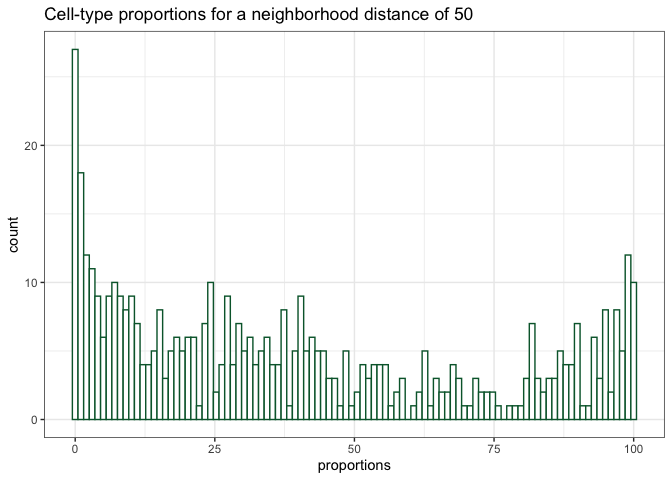
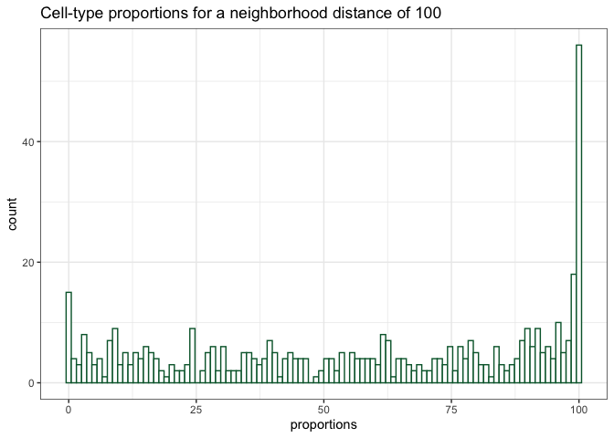
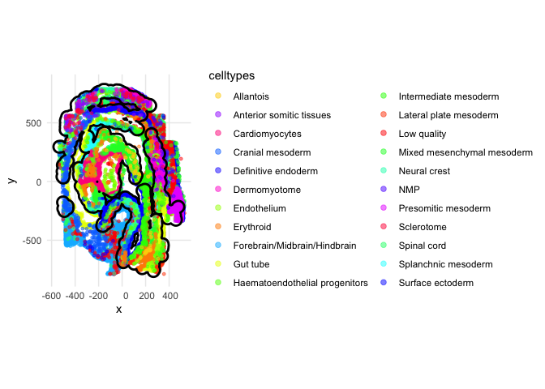

# Overview

The neighborhood distance, `neighDist`, is one of the parameters used in
CRAWDAD’s analysis. This value defines the radius to create the
neighborhood around the cells of the reference cell type. We recommend
choosing the neighborhood distance to reflect the biological question of
interest and adjust it using visualization. The [Discussion section of
our paper](https://www.nature.com/articles/s41467-024-55700-1#Sec8)
details, with supplementary figures, how to pick the best neighborhood
distance. In this tutorial, we demonstrate how to use CRAWDAD’s function
to support this choice.

Additionally, the neighborhood distance and the scales used in CRAWDAD
should reflect the coordinate units of your data. Throughout CRAWDAD’s
paper, we used only micrometers, but if your data is in nanometers, for
example, your neighborhood distance and scales should also be in
nanometers.

## Load the data

For this tutorial, we chose the seqFISH mouse embryo data which is
available with the CRAWDAD package.

``` r
## load CRAWDAD
library(crawdad)
## load ggplot2 to add the figure titles
library(ggplot2)
```

``` r
## load seqFISH data
data('seq')
## convert data.frame to sf object
cells <- crawdad::toSF(pos = seq[,c("x", "y")], cellTypes = seq$celltypes)
```

    ## Warning: 'celltypes' does not have levels. Creating levels from values

    ## creating `sf` object

## Visualize different neighborhoods

CRAWDAD has a function called vizCelltypeProportions which takes the
cells sf object and a neighborhood distance value. Given the neighDist
parameter, it calculates the proportion of each cell type inside the
reference cell-type neighborhood, repeating this for all reference cell
types. Then, it plots a histogram of these proportions. Here, we
visualize the histogram for three different `neighDist` values.

``` r
## histogram for neighDist = 10
vizCelltypeProportions(cells, neighDist = 10) + 
  labs(title = 'Cell-type proportions for a neighborhood distance of 10')
```


``` r
## histogram for neighDist = 50
vizCelltypeProportions(cells, neighDist = 50) + 
  labs(title = 'Cell-type proportions for a neighborhood distance of 50')
```



``` r
## histogram for neighDist = 100
vizCelltypeProportions(cells, neighDist = 100) + 
  labs(title = 'Cell-type proportions for a neighborhood distance of 100')
```



## Choose the right value

To compute the cell-type spatial relationships, CRAWDAD compares the
proportions of the neighbor cell types inside the reference cell-type
neighborhood before and after shuffling the labels. Additionally, the
cell-type proportion histograms reflect the proportion of each cell type
inside the neighborhood of a reference cell type. Therefore, if the
histogram is shifted towards the 0 proportions, we can interpret this
result as having most cell types not present inside the reference
neighborhood. Thus, the proportions before and after shuffling would not
change much and the results would not be statistically significant. On
the other hand, if the histogram is shifted towards the 100 proportions,
most cell types would be fully inside the reference neighborhood, the
proportions before and after shuffling would not change, and the results
would not be significant.

In our case, given the three values tested, the histogram of
`neighDist = 10` is shifted towards the left (0 proportions) while the
histogram of `neighDist = 100` is shifted towards the right (100
proportions). The histogram of `neighDist = 50` has a more even
distribution of the cell-type proportions. Therefore, our choice of the
neighborhood distance parameter for CRAWDAD should be `neighDist = 50`.

Additionally, we can use CRAWDAD’s vizClusters function, setting the
parameters of ref and neighDist, to visualize the neighborhood in space
(x and y coordinates).

``` r
vizClusters(cells, ref = 'Endothelium', neighDist = 50, lineWidth = 1)
```


